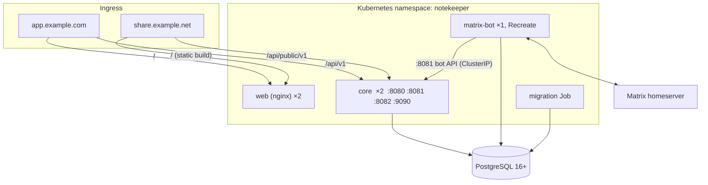

# 8. Deployment, configuration and testing

Covers NFR-D*, NFR-O*, NFR-Q*, SEC-OPS-*, SEC-BASE-*. Deployment artefacts in this repository are **examples** (NFR-D6): docker-compose for development and end-to-end tests, and Kustomize manifests that show how to run the components. Provisioning PostgreSQL and the cluster is the operator's job.

## 1. Topology

- **Hostnames:** the application hostname and the **share hostname**, preferably on different registrable domains so that no cookie can be scoped to both (CORE-SH8, SEC-SHR-5). Both point at the same nginx image; nginx serves different `server` blocks: on the share host only `/` (static build) and no other route, no cookies, the strict CSP of [07](07-web-app.md) §7.
- **Ingress routing:** on the application host `/api/v1` → Core `:8080`, `/s` and below → 404 (the share page is never loaded on the application's origin), everything else → web. On the share host `/api/public/v1` → Core `:8082`, everything else → web. **Nothing routes to `:8081` or `:9090`** (SEC-OPS-4). Core additionally checks the `Host` header per listener ([README](README.md) §2).
- **Bot API** is a ClusterIP Service used only by bot pods, enforced by a NetworkPolicy (SEC-OPS-3).
- **TLS** terminates at the ingress; the example enables HSTS and modern protocols (SEC-OPS-8, SEC-BASE-3). Database connections use TLS where the server offers it (SEC-DATA-4).

## 2. Kubernetes examples (`deploy/k8s`)

Kustomize base plus one example overlay.

| Object | Notes |
|---|---|
| `Deployment core` | 2 replicas, rolling update; readiness `/readyz` (database reachable, migrations current), liveness `/healthz`; graceful shutdown drains requests, sends `event: reconnect` on SSE streams, stops River workers cleanly |
| `Deployment web` | 2 replicas of `nginx-unprivileged`, static files |
| `Deployment matrix-bot` | 1 replica, `strategy: Recreate`, readiness `/readyz` |
| `Job migrate` | runs `core migrate` with the migration role; the rollout waits for it |
| `Service`s, `Ingress` | as in §1 |
| `NetworkPolicy` | default deny; allow ingress → web and Core (`8080`, `8082`); bot → Core `8081` and homeserver egress; Core and bot → PostgreSQL; nothing else |
| `Secret` templates | placeholders that make Core refuse to start if unchanged (SEC-OPS-1, SEC-OPS-7): database URLs for the three roles, token MAC keys, bot pickle key, Matrix credentials, bot key |
| `ConfigMap` | non-secret configuration (below) |
| Security context on every pod | `runAsNonRoot`, `readOnlyRootFilesystem`, `allowPrivilegeEscalation: false`, capabilities dropped, `seccompProfile: RuntimeDefault` (SEC-OPS-2) |

Prometheus scraping is by pod annotation to `:9090`; alert rules for the events of SEC-AUD-3 are provided as an example.

## 3. Configuration

Environment variables; safe defaults; every one is documented in [configuration.md](../configuration.md), and a test fails when the documentation and the code disagree (NFR-O5, SEC-BASE-5). The table below is the summary.

| Variable | Default | Purpose |
|---|---|---|
| `NK_DATABASE_URL` | none | Core runtime role (`nk_app`, no DDL rights) |
| `NK_MIGRATE_DATABASE_URL` | none | Used only by `core migrate`, which needs nothing else: the schema-owning role. Kept in a Secret that only the migration Job reads; a serving process logs a warning if it holds it (SEC-OPS-5) |
| `NK_APP_URL`, `NK_SHARE_URL` | none | Public hostnames (host checks, links) |
| `NK_TOKEN_KEYS` | none | `kid:base64key` list for token MACs (each at least 32 bytes); first signs, all verify. Core refuses to start without it or with a `change-me` placeholder |
| `NK_ACCESS_TOKEN_TTL` | 15m | |
| `NK_SESSION_IDLE_LIFETIME` | 90d | Sliding (AUTH-C9) |
| `NK_SESSION_ABSOLUTE_LIFETIME` | 365d | `0` = unlimited |
| `NK_REFRESH_GRACE` | 60s | SEC-AUTH-7 |
| `NK_ACTIVATION_TTL` | 7d | AUTH-U8 |
| `NK_SHARE_MAX_LIFETIME` | 30d | CORE-SH2 |
| `NK_SHARE_ENABLED` | true | CORE-SH11 |
| `NK_SHARE_MAX_ACTIVE` | 200 | Links one user may hold at once (SEC-SHR-11); creation is also capped at 30 per hour per user |
| `NK_MAX_ATTACHMENT_BYTES` | 25 MiB | CORE-A3 |
| `NK_DEFAULT_QUOTA_BYTES` | 2 GiB | CORE-A3 |
| `NK_GROUPING_WINDOW` | 60s | GRP-5 (per-user override in settings) |
| `NK_TRUSTED_PROXIES` | none | Ingress addresses trusted for `X-Forwarded-For` |
| `NK_ARGON2_MEMORY_KIB`, `NK_ARGON2_ITERATIONS`, `NK_ARGON2_PARALLELISM`, `NK_ARGON2_CONCURRENCY` | 65536, 3, 2, 4 | SEC-BASE-1; the last bounds hashes computed at once (SEC-API-4) |
| Bot: `NK_CORE_URL`, `NK_BOT_KEY`, `MX_HOMESERVER`, `MX_USER`, `MX_PASSWORD`, `MX_PICKLE_KEY` (at least 16 characters), `NK_BOT_DATABASE_URL`, `NK_BOT_INSTANCE` (default `matrix`, names the advisory lock), `NK_BOT_LISTEN` (default `:9091`, health and metrics) | none | |

## 4. Backup and restore (NFR-R4)

Everything is in PostgreSQL, including attachments and the bot's crypto state, so a standard `pg_dump` or PITR backup covers the system. The restore procedure (documented with the examples): restore the database, apply `core migrate`, start Core and bot. After restoring an *older* backup the bot's device state may be stale relative to the homeserver; the runbook covers logging in as a new device.

## 5. Test plan

Tiers and `make` targets are fixed by NFR-Q5 and the tech-stack; this section says what each tier must contain.

| Tier | Target | Contents |
|---|---|---|
| Unit | `make test`, `test-core`, `test-bot`, `test-web` | `grouping.decide` table tests (every scenario of [04](04-ingestion.md) §4), `timeparse`, fractional keys (Go and TypeScript against **shared test vectors**), token derivation and grace-window logic, password policy, Markdown renderer XSS corpus, checklist offsets, bot normalisation (fixtures of real Matrix events) |
| Integration | `make test-integration` | Real PostgreSQL 16 and newest. Repository and transaction tests; the **OpenAPI-generated authorisation matrix** (every route × anonymous, user, other user, admin, bot, share-token holder; CI fails on a route without declared actors; SEC-ISO-1); router-vs-spec route walk; tenant isolation and RLS tests (SEC-ISO-2..4); **streaming memory test** (large upload and download under a small `GOMEMLIMIT`, memory stays flat; CORE-A8); quota races (parallel uploads cannot exceed quota; SEC-CNT-6); concurrent ingest of one conversation (SEC-API-7); refresh races and grace window (SEC-AUTH-7, SEC-AUTH-15); change-feed ordering under concurrent writers (CORE-S3); outbox claiming with two workers; reminder firing with two replicas; deletion completeness (SEC-DATA-5); log-scan test for leaked secrets and content (SEC-DATA-1); response-header tests per listener |
| End to end | `make test-e2e` | Compose stack: PostgreSQL, Synapse, Core, web, bot. Playwright drives the web app; a second mautrix client plays the Element user in an **encrypted** DM ([06](06-matrix-bot.md) §10). Flows F0–F11 of the requirements, plus: bot restart mid-batch, Core restart while an SSE stream is open, session survival across a Core restart |

**Speed.** Integration tests never roll back a transaction per test: NOTIFY, the change feed, outbox leases and `SKIP LOCKED` all depend on commits. Instead `core/internal/testdb` starts one PostgreSQL container per test binary (with durability switched off), migrates once into a template database and clones it per test (`create database … template`, tens of milliseconds, parallel-safe). The Matrix suites share one Synapse and one PostgreSQL per package and stay independent through unique user and database names. `make test` needs no Docker; `make check` is a milestone-boundary command.

Requirement states are updated (`unimplemented` → `implemented` → `fully tested`) in the same commit as the code and tests; `09-traceability.md` names the tier that verifies each requirement.

## 5a. What was built

Images: `deploy/docker/Dockerfile.{core,bot,web}` (Core static on distroless; the bot on Debian slim with libolm; the web app on unprivileged nginx). The web image renders two nginx server blocks from `deploy/nginx` (application host and share host) with the headers of `headers.conf`. `deploy/docker-compose.stack.yml` runs PostgreSQL, the migration, Core and the web image; `make test-e2e-stack` runs the browser tests through it, including `headers.spec.ts`, which checks the CSP, HSTS, routing and the share host. `deploy/k8s` is the Kustomize base and example overlay; `core/internal/deploycheck` tests them (pod security, placeholder secrets, NetworkPolicies, ingress routes and TLS, alerts that use real metrics, minimal non-root images, TLS to the database, no media libraries).

## 6. CI (`make check`)

`golangci-lint`, `tsc`, ESLint, `kustomize build` with `kube-linter` and `kubeconform` on the example manifests, (including the `dangerouslySetInnerHTML` ban), `make generate` drift check, all test tiers, `govulncheck`, `osv-scanner`, `trivy` on the built images (the `images` job of the GitHub workflow; it runs there only), `kube-linter` and `kubeconform` on the manifests, `gitleaks` (SEC-OPS-1, SEC-OPS-6), and **`make docs-check`**, which runs `docs/design/tools/traceability.py`: it fails if a requirement has no design mapping, or if a Must is only "deferred"; it then regenerates [09-traceability.md](09-traceability.md) and the target fails if that changes the committed file (`git diff --exit-code`), so the design cannot silently drift from the requirements.

### 6.1 The GitHub workflows

- **`ci.yml`** runs `make check` as separate jobs side by side, each calling the same Makefile targets: generated code and docs current (`generate-check`, `docs-check`), `lint`, unit tests, Core integration (PostgreSQL), bot integration (Synapse), and the secret and vulnerability scans. Besides these it runs `e2e` (Chromium), Firefox and WebKit (`@cross` tests, one job each; both block), `images` (build and trivy scan of the three images) and `e2e-stack` (the built images behind nginx). The last job, **`CI passed`**, succeeds only when all the others did: it is the one status to require on a protected branch. The workflow runs on **every pull request** and on **every push to master**; a new push to a pull request cancels its earlier run, and every commit on master has a run of its own that is neither cancelled nor queued behind another. It can be called by another workflow.
- **Speed.** The pinned tools (`make tools` compiles ten of them in about four minutes) and the Playwright browsers are cached (`.github/actions/setup`, which every job uses for what it needs); the images are built with the Docker layer cache, one cache per image, shared by the `images` and `e2e-stack` jobs and the release; the Dockerfiles download Go modules in a layer of their own. The tool cache key is the hash of the `Makefile` and `go.work`, so changing a pinned version rebuilds the tools once.
- **`release.yml`** runs when a version tag `vX.Y.Z` (or `vX.Y.Z-rc1`) is pushed. Unless a `ci.yml` run on a push has already succeeded for the tagged commit (the usual case: the commit was merged to master first), it calls `ci.yml`; only when CI has passed, one way or the other, does it build and push `ghcr.io/<owner>/notekeeper-core`, `notekeeper-web` and `notekeeper-matrix-bot` (linux/amd64) with the tags `X.Y.Z`, `X.Y` and, for a version without a pre-release suffix, `latest`, embeds the version in the binaries, attaches a build-provenance attestation, and creates a GitHub release with generated notes. Only the publishing job has `packages: write`.
- **Running the browser tests by hand:** `make test-e2e` (Chromium); `E2E_BROWSERS=all e2e/run.sh --project=firefox` and `E2E_BROWSERS=all E2E_TLS=1 e2e/run.sh --project=webkit` for the other engines (WebKit needs https for its Secure cookies; the script makes and removes a throwaway certificate). A workstation without the browsers' system libraries can set `E2E_PLAYWRIGHT_IMAGE=mcr.microsoft.com/playwright:v1.63.0-noble` (the version of `e2e/package.json`) to run the browsers in Playwright's image against the local stack, `NK_LOG_LEVEL=info` for Core's request log, and `E2E_HOLD=<seconds>` to keep the stack up for a look with a browser (the script prints the activation link).
- **`dependabot.yml`** proposes updates of the actions (including the shared setup action), the three Go modules, npm and the base images every week, each as a pull request that runs the full CI; minor and patch updates of an ecosystem come together in one pull request, a major update in a pull request of its own.

The example Kustomize overlay points at the ghcr names.

## 7. Observability

`slog` JSON logs with request ids (bots send `X-Request-ID` so one chat message can be followed end to end, NFR-O1). Metrics on `:9090` (NFR-O2): HTTP by route class (not counting the time a realtime stream stays open), ingest outcomes and grouping decisions, change-feed and SSE gauges and refused streams, outbox depth, age of the oldest waiting item and delivery outcomes, reminder scheduling lag, job runs, durations, failures and the time of the last success (a stopped job produces no failures, so alerts read the last success), database pool use and waits, auth events including replayed refresh tokens, rate-limit hits, share-link 404s, the build version. Labels are small closed sets, and never `job` (Prometheus adds its own and would rename ours to `exported_job`). Example alerts are in `deploy/k8s/base/prometheusrule.yaml` and four Grafana dashboards in `deploy/grafana/`; a test checks that every metric they query exists.
