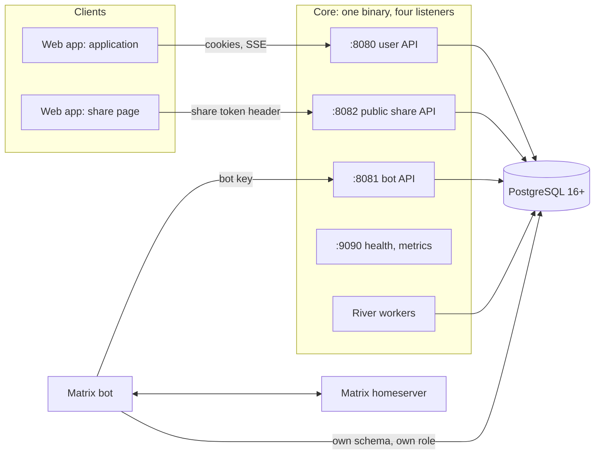

# Notekeeper — Technical design

Status: draft v0.1. Builds on [requirements.md](../requirements.md), [security-requirements.md](../security-requirements.md) and [tech-stack.md](../tech-stack.md). This is a design document: it says *how*, not *what*. Requirement IDs are cited so that every decision can be traced back; [09-traceability.md](09-traceability.md) maps every requirement to the design section that implements it and the test tier that verifies it.

## Reading guide

| File | Contents |
|---|---|
| this file | Architecture, process model, cross-cutting conventions, decisions that change the requirements |
| [01-data-model.md](01-data-model.md) | PostgreSQL schema, ordering, attachments, search, change log |
| [02-api.md](02-api.md) | The user, bot and public share APIs: resources, conventions, streaming |
| [03-auth.md](03-auth.md) | Accounts, sessions and tokens, activation, pairing and bot authentication, share tokens |
| [04-ingestion.md](04-ingestion.md) | Chat message to note: grouping, edits, deletions, commands, reminders parsing |
| [05-realtime-and-jobs.md](05-realtime-and-jobs.md) | Change feed, SSE, background jobs, the bot outbox, reminders |
| [06-matrix-bot.md](06-matrix-bot.md) | The Matrix bot |
| [07-web-app.md](07-web-app.md) | The web app, including the share page |
| [08-deployment-and-testing.md](08-deployment-and-testing.md) | Topology, configuration, deployment, test plan |
| [09-traceability.md](09-traceability.md) | Requirement → design → test map (generated) |

## 1. Architecture

- **One Core binary** exposes three HTTP APIs on three listeners and runs the background workers in-process (River). The listeners are separate so that network policy and ingress can treat them differently (NFR-S2, SEC-OPS-3, SEC-OPS-4).
- **Everything durable is in PostgreSQL** (NFR-D1, NFR-D2): data, blobs, sessions, the job queue, the change log, the outbox. Replicas coordinate through the database only: row locks, `SKIP LOCKED`, and `LISTEN/NOTIFY`.
- **Bots are API clients.** The Matrix bot talks to Core only through the bot API; it owns only its own schema for Matrix crypto and sync state.

## 2. Process model

| Listener | Port | Routes | Exposure | Authentication |
|---|---|---|---|---|
| User API | 8080 | `/api/v1/*`, SSE at `/api/v1/events` | Ingress, application hostname | Session cookies (web), bearer tokens (native, later) |
| Bot API | 8081 | `/bot/v1/*` | Cluster-internal only (NetworkPolicy: bot pods only) | Bot key |
| Public share API | 8082 | `/api/public/v1/*` | Ingress, **share hostname only** | Share token in a request header |
| Ops | 9090 | `/healthz`, `/readyz`, `/metrics` | Cluster-internal, never routed by ingress (SEC-OPS-4) | None (network-restricted) |

Each listener has its own router containing only its own routes, and a middleware that rejects a request whose `Host` is not one of that listener's configured hostnames. A route can therefore not be reached through the wrong listener even if ingress is misconfigured (CORE-SH10, SEC-API-2).

**Modes.** `core serve` runs the listeners and workers; `core migrate` applies migrations (used by the migration Job); `core admin …` are operator commands (bootstrap, link, transfer; see [03-auth.md](03-auth.md)). Workers can be split out with `--workers-only` without code changes.

## 3. Cross-cutting conventions

**Identifiers.** UUIDv7 generated by the application (NFR-D8), stored as `uuid`. Clients may generate identifiers for creation (CORE-S5).

**Time.** `timestamptz` in the database, RFC 3339 UTC on the wire. "Created" for chat-derived content is the platform event timestamp (CORE-N18); receive time is stored separately.

**Errors.** `application/problem+json` (RFC 9457) with a stable machine `code`, a generic English `title`, and a `request_id`; no internals (SEC-API-5). Foreign and non-existent IDs both return `404 not_found` with identical body and timing class (SEC-ISO-3).

**Concurrency (CORE-S4).** Every mutable entity has an integer `version`. Text edits carry `base_version`: they are always applied (latest wins, EDT-5); the response reports `stale: true` if the base was out of date so the client can say the note changed, and the overwritten text remains in history. Structural operations (move, reorder, dismiss, restore) take no version and never conflict across different notes.

**Idempotency (CORE-S5, BOT-7).** Creations take a client-generated `id`; repeating a creation with the same owner and identical content returns the existing resource, with different content returns `409`. Side-effecting actions (create share link, create pairing code, admin actions) accept an `Idempotency-Key` header, recorded per caller for 24 hours. Bot events are deduplicated by `(bot instance, event id)`.

**Pagination.** `limit` (default 50, maximum 200) and opaque `cursor`; responses are `{items, next_cursor}`.

**Per-user write serialisation.** Every write transaction that changes user-owned data starts with `SELECT … FROM users WHERE id = $1 FOR UPDATE` and increments `users.change_seq` (see [01-data-model.md](01-data-model.md) §5). This one lock gives three guarantees at once: a gapless per-user change feed in commit order (CORE-S3), serial grouping decisions for all of a user's conversations (GRP-1..4, BOT-9), and atomic invariants such as quota. With at most a few dozen users and short transactions the contention is negligible (NFR-P3). **Lock order:** user row first, always; no operation ever locks two users.

**Row-level security (SEC-ISO-10, NFR-S3).** The **content tables** carry `user_id` and have a policy `user_id = current_setting('app.user_id')::uuid`: `pages`, `categories`, `notes`, `note_parts`, `note_part_versions`, `note_search`, `attachments`, `blobs`, `blob_chunks`, `reminders`, `notifications`, `changes`. The application role has no `BYPASSRLS`. Each request transaction runs `SET LOCAL app.user_id`; the bot API sets it after resolving the identity to a user, the public API after resolving the share link to its owner, and workers set it per unit of work (per reminder, per deletion batch). Tenant filters in queries remain (RLS is the second barrier). The tables used to *find* the user (`users`, `user_storage` (counters only), `sessions`, `user_tokens`, `pairing_codes`, `external_identities`, `share_links`, `bot_*`, `bot_outbox`, `ingest_events`, `audit_log`, throttling and idempotency tables) hold no note content and are not under RLS; admin endpoints only touch `users`, the `user_storage` counters and the `bot_*` tables, which is what keeps the admin from reading content through the application (SEC-ADM-1).

**Rate limits.** Token buckets per user, per IP and per bot instance, held in memory per replica (limits are therefore approximate across two replicas, which is fine for abuse control). Authentication throttling is different: it is stored in PostgreSQL so it holds across replicas (see [03-auth.md](03-auth.md) §3).

**Logging and metrics.** `slog` JSON with `request_id` (propagated from bots in `X-Request-ID`), `user_id` and route; never bodies, tokens, filenames or note content (SEC-DATA-1). Prometheus metrics on the ops listener.

**Configuration.** Environment variables; safe defaults (SEC-BASE-5). Secrets only via Kubernetes Secret references; startup fails if a known placeholder secret is unchanged (SEC-OPS-1, SEC-OPS-7).

## 4. Design decisions that amend the requirements

These decisions came up while designing. The requirement files were updated in the same commit; each is listed here so the reason is on record.

| # | Decision | Amended |
|---|---|---|
| D1 | The **Inbox is ordered by created time, newest first**; manual ordering exists only inside categories. This removes the conflict between "user-controlled order" and "backlog appears chronologically". Moving a note out of the Inbox is still by drag and drop. | CORE-N2, CORE-N4, CORE-N18 |
| D2 | Share-page attachments are fetched by the page with the share token in a header and shown through blob URLs, so **no token or signature ever appears in a URL**. Consequence: no `Range` requests on the share page; the 25 MiB cap (CORE-A3) makes this acceptable. | CORE-SH7 |
| D3 | Issuing an **activation link clears the user's current password**; the account is pending activation until the link is used. | AUTH-U8 |
| D4 | The admin is bootstrapped only by the operator CLI (`core admin bootstrap`), never from environment variables, so there is no bootstrap secret to leak or leave behind. | AUTH-U7 |
| D5 | Authenticated attachments use `Cache-Control: private, no-cache` with an `ETag`, so shared caches never store them but clients can revalidate cheaply (reconciles SEC-DATA-6 with AND-5). | SEC-DATA-6 |
| D6 | Search uses a **trigger-maintained `note_search` table**, not a generated column, because the indexed text spans several tables. | tech-stack.md §3.3 |

## 5. Failure behaviour in one table

| Failure | Behaviour |
|---|---|
| Core down | Web shows an offline banner; bots retry with backoff and the Matrix sync token does not advance, so nothing is lost (NFR-R1). |
| PostgreSQL down | Readiness fails, replicas leave the load balancer; in-flight requests error with generic 503. |
| One Core replica killed | SSE clients reconnect elsewhere and catch up from the change feed; workers' claimed jobs are retried after their leases expire. |
| Bot down | Outbox items wait (leases expire, items are offered again); reminders go out late and flagged (CORE-R4). |
| Homeserver down | The bot's sync stalls and resumes from the stored token; Core is unaffected. |
