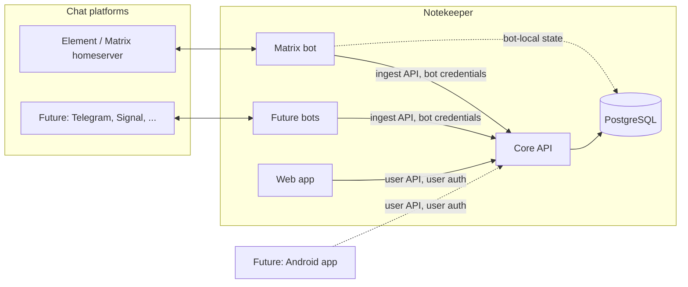

# Notekeeper — Requirements

Status: draft v0.1 — requirements only. Technology choices appear only where a constraint forces them (Postgres, Kubernetes, Matrix E2EE, native-client auth).

## 1. Purpose and vision

Today, notes-to-self (todo lists, reminders, concert tickets, links, ...) are sent to a private Matrix room using Element. It is the lowest-friction capture method: it is installed on every device and needs no extra thought.

Notekeeper keeps that **capture flow** and adds a place to **organise** what was captured:

1. The user sends a message to a chat bot, exactly as they do today.
2. The bot forwards it to the user's Notekeeper account, where it lands as a note in an **Inbox** ("uncategorized").
3. In the web app the user sorts notes into **categories** (columns) on **pages** by dragging, and dismisses notes once done. Dismissed notes can be restored.

Guiding principles:

- **Capture stays effortless.** The chat side must never require more effort than it does today. All organisation happens later, in the app.
- **Chat apps are interchangeable inputs.** Matrix is first, but the system must not be shaped around it.
- **The API is the product.** The web app, bots and a future Android client are all clients of one API.

## 2. Scope

### 2.1 In scope (v1)

- A backend service (the **Core**) that owns all data and business rules.
- A **web app** for organising notes.
- A generic **bot integration contract** and one implementation: a **Matrix bot**.
- User accounts, authentication, and linking of chat identities to accounts.
- Deployment on Kubernetes with PostgreSQL as the only stateful dependency.

### 2.2 Out of scope for v1 (but must not be precluded)

- Android client (see §9) and any other native client.
- Additional bots (Telegram, Signal, WhatsApp, e-mail, ...).
- Reminders / due dates / push notifications; messages from Core back to chat.
- Sharing notes or pages between users, collaboration.
- Checklists as a structured note type (todo lists are plain text for now).
- End-to-end encryption of notes at rest inside Notekeeper.
- Offline editing (but the API must be sync-friendly, see NFR-API).

### 2.3 Glossary

| Term | Meaning |
|---|---|
| **User** | A Notekeeper account holder. |
| **Note** | The unit of content: text and/or attachments, plus metadata. Lives in exactly one place: the Inbox or one category. |
| **Note part** | One contribution to a note, usually one chat message (a text or a file). A note consists of one or more ordered parts. |
| **Inbox** | The per-user "uncategorized" holding area. New notes always start here. |
| **Page** | A user-defined board (e.g. "Work", "Chores"). Contains categories. |
| **Category** | A user-defined column on a page. Contains notes. |
| **Trash** | Dismissed (soft-deleted) notes. |
| **Bot** | A service that connects one chat platform to Notekeeper. |
| **Bot instance** | One deployed, credentialed bot (e.g. "my Matrix bot on homeserver X"). |
| **External identity** | A user's identity on a chat platform (e.g. `@robin:example.org`). |
| **Source reference** | The bot instance + conversation + message ID a note part originated from. |

## 3. System overview

**Components**

| Component | Responsibility |
|---|---|
| **Core** | Single source of truth. Users, auth, pages/categories/notes, trash, attachments, message grouping and edit handling, realtime change feed. Exposes the public HTTP API. |
| **Web app** | Browser UI. A client of the user-facing API only; no privileged access. |
| **Bot(s)** | Translate between a chat platform and the bot-facing part of the Core API. Contain platform-specific logic only (protocol, encryption, message formats). |
| **PostgreSQL** | All persistent state of Core (and any durable state the bots need). |

**Key design decision — where does "smart" logic live?** Grouping of messages into notes, edit propagation and deduplication live in the **Core**, not in the bots. Bots forward normalised events and platform hints (replies, threads, edits, timestamps); Core decides what they mean. This keeps behaviour consistent across chat platforms and keeps bots thin, so adding a bot is cheap.

## 4. Core

### 4.1 Domain model (conceptual)

- A **User** owns Pages, Categories, Notes, Attachments, linked External identities and Bot links.
- A **Page** has an ordered list of **Categories**. Pages themselves are ordered.
- A **Note** belongs to the Inbox (no category) or to exactly one Category, at an explicit position. It has a state: `active` or `deleted`.
- A **Note** has one or more ordered **Note parts**. Each part is text and/or an attachment, and optionally has a **Source reference**.
- **Attachments** are binary blobs (images, PDFs, ...) with filename, media type, size.
- All entities have stable, globally unique, client-generatable IDs (UUIDs), creation/modification timestamps and a version counter.

### 4.2 Notes — functional requirements

| ID | Pri | Requirement |
|---|---|---|
| CORE-N1 | Must | Notes are created with text and/or attachments. A note always has at least one part. |
| CORE-N2 | Must | New notes created via a bot are placed in the Inbox of the linked user, at the top. |
| CORE-N3 | Must | A note can be moved to any category of any of the user's pages, at a chosen position, or back to the Inbox. |
| CORE-N4 | Must | Note order within a category / the Inbox is user-controlled and persistent. |
| CORE-N5 | Must | Note text can be edited in the app. Text supports lightweight formatting (Markdown subset) and auto-linked URLs. |
| CORE-N6 | Must | Deleting ("dismissing") a note is a **soft delete**: state becomes `deleted`, `deleted_at` is set, and the note remembers its previous location. |
| CORE-N7 | Must | A deleted note can be **restored** to its previous location; if that category no longer exists, it is restored to the Inbox. |
| CORE-N8 | Must | Undo of a dismissal is a server-side restore, so it works from any device and from the Trash view, not just as a transient client-side action. |
| CORE-N9 | Must | Deleted notes can be listed (Trash), newest-deleted first, with their previous page/category shown. |
| CORE-N10 | Should | Permanently deleting a note (and its attachments) from the Trash on explicit user action. |
| CORE-N11 | Should | Trash retention: deleted notes are kept until permanently deleted, or optionally auto-purged after a per-user configurable period. Default: keep indefinitely. |
| CORE-N12 | Should | Undo of a move (last drag) in addition to undo of dismissal. |
| CORE-N13 | Should | Full-text search over active and (optionally) deleted notes, per user. |
| CORE-N14 | Should | Manually **merge** two notes and **split** a part out of a note, to correct wrong automatic grouping (see §6.3). |
| CORE-N15 | Could | Bulk operations (dismiss/move multiple notes). |

### 4.3 Pages and categories — functional requirements

| ID | Pri | Requirement |
|---|---|---|
| CORE-P1 | Must | Users can create, rename, reorder and delete pages. |
| CORE-P2 | Must | Users can create, rename, reorder and delete categories within a page. |
| CORE-P3 | Must | Categories can be moved to another page. |
| CORE-P4 | Must | Deleting a category never destroys notes: its notes are moved to the Inbox (and the user is told how many). Deleting a page does the same for all its categories. |
| CORE-P5 | Must | A new account starts with an empty Inbox and no pages; the UI guides the user to create the first page. |
| CORE-P6 | Could | Archive a page (hidden from the main navigation, not deleted). |
| CORE-P7 | Could | Per-category colour/icon. |

### 4.4 Attachments

| ID | Pri | Requirement |
|---|---|---|
| CORE-A1 | Must | Attachments are stored by Core and served only to the owning user (authenticated, authorised requests; no public or guessable URLs). |
| CORE-A2 | Must | Attachment storage sits behind an abstraction. v1 implementation stores blobs in PostgreSQL (consistent with "everything in Postgres"); an S3-compatible object store must be swappable in later without API changes. |
| CORE-A3 | Must | Configurable maximum attachment size (default: 25 MiB) and per-user storage quota; violations produce a clear error that the bot can relay to the user. |
| CORE-A4 | Must | Attachments keep filename and media type. Images get generated thumbnails/previews for the UI. |
| CORE-A5 | Should | Deduplicate identical blobs per user (content hash). |
| CORE-A6 | Should | Uploads and downloads are streamed/chunk-friendly so large files do not need to be fully buffered in memory. |

### 4.5 Realtime and sync

| ID | Pri | Requirement |
|---|---|---|
| CORE-S1 | Must | Clients see changes made elsewhere (new note from a bot, edit, move on another device) without manual reload (push channel such as SSE or WebSocket). |
| CORE-S2 | Must | Realtime delivery works with multiple Core replicas (no in-process-only pub/sub). |
| CORE-S3 | Must | A **change feed** endpoint returns all changes (including deletions/tombstones) since an opaque cursor, so clients can (re)sync incrementally after being offline or reconnecting. |
| CORE-S4 | Must | Mutations use optimistic concurrency (version/ETag). Conflicting concurrent edits are detected, not silently overwritten. Moves/reorders are handled so that two devices reordering different notes do not conflict. |
| CORE-S5 | Must | Mutating requests accept an idempotency key or client-generated ID so retries are safe. |

## 5. Accounts and authentication

### 5.1 Users and accounts

| ID | Pri | Requirement |
|---|---|---|
| AUTH-U1 | Must | The system supports multiple users with strict data isolation. Every data access is scoped to the authenticated user; this is enforced centrally, not per endpoint by convention. |
| AUTH-U2 | Must | A user account has: unique ID, e-mail (login identifier), display name, created timestamp, status (active/disabled). |
| AUTH-U3 | Must | Sign-up policy is configurable: **closed** (admin-created / invite only) or open. Default: closed. |
| AUTH-U4 | Must | Users can change their password, view and revoke active sessions/devices, and delete their account (deleting all data, including attachments). |
| AUTH-U5 | Should | Users can export all their data (notes, pages, attachments) in an open format. |
| AUTH-U6 | Should | A minimal admin capability: create/disable users, reset passwords, list bot instances. Can be CLI/API-only in v1. |

### 5.2 Authenticating users (web now, Android later)

| ID | Pri | Requirement |
|---|---|---|
| AUTH-C1 | Must | Local authentication with e-mail + password. Passwords are stored only as salted hashes using a modern password hash (e.g. argon2id). |
| AUTH-C2 | Should | Optional delegation to an external OpenID Connect provider, so an existing IdP can be used instead of / next to local passwords. |
| AUTH-C3 | Must | The auth mechanism is suitable for both browsers and native mobile apps: short-lived access tokens plus revocable, rotating refresh tokens, obtained via a standard flow (OAuth 2.0 authorization code + PKCE for native/public clients). No design that only works with browser cookies. |
| AUTH-C4 | Must | Web sessions are protected against CSRF and XSS-based token theft (e.g. HttpOnly, SameSite cookies or equivalent), and all traffic is over TLS. |
| AUTH-C5 | Must | Auth state is not held in Core process memory: any replica can serve any request (sessions/refresh tokens live in Postgres or are self-contained signed tokens with a revocation mechanism). |
| AUTH-C6 | Must | Login is rate-limited and brute-force resistant. |
| AUTH-C7 | Should | TOTP or passkey as a second factor. |
| AUTH-C8 | Could | Personal access tokens for scripts/automation, scoped and revocable. |

### 5.3 Authenticating bots and linking chat identities

Bots are **not users** and do not hold user passwords. There are two separate concerns:

1. **Bot instance authentication** — proving to Core that a request comes from a trusted bot deployment.
2. **Identity linking** — mapping a chat identity (e.g. Matrix ID) to exactly one Notekeeper user, with that user's consent.

| ID | Pri | Requirement |
|---|---|---|
| AUTH-B1 | Must | A **bot instance** is registered in Core (by an admin, or self-service in v1 if single-tenant) with a type (`matrix`, ...), a name, and a rotatable credential (client ID + secret, or equivalent). Credentials are stored hashed; multiple credentials can be valid during rotation. |
| AUTH-B2 | Must | Bot credentials carry a narrow scope (`bot:ingest`) that permits only the bot-facing API. They can never call user-facing endpoints, and a bot can act only for users who have **linked** an external identity to that bot instance. |
| AUTH-B3 | Must | **Linking flow**: (a) the user, logged in to the web app, requests a link for a bot type/instance and receives a short-lived (e.g. 10 min), single-use pairing code; (b) the user sends that code to the bot in chat (e.g. `!link <code>`); (c) the bot submits the code plus the sender's external identity to Core; (d) Core binds the external identity to the user and the bot replies with a confirmation. |
| AUTH-B4 | Must | An external identity (`bot type` + `platform user ID`, e.g. homeserver-qualified) maps to at most one Notekeeper user. A user may link many external identities, across many bot instances and platforms. |
| AUTH-B5 | Must | Users can list and revoke their links in the web app. Revocation takes effect immediately; further messages from that identity are rejected and the bot tells the sender the identity is unlinked. |
| AUTH-B6 | Must | Messages from unlinked identities are never stored. The bot replies once (rate-limited) with linking instructions. |
| AUTH-B7 | Must | Ingest requests are attributed: every note part records which bot instance and external identity created it. |
| AUTH-B8 | Should | Audit log of bot-related security events (link created/revoked, credential rotated, rejected requests). |
| AUTH-B9 | Could | Alternative to a shared bot service: per-user, per-bot revocable tokens (useful for very simple bots/scripts). The ingest API should be usable that way with no changes beyond auth. |

## 6. Bot integration contract (platform-independent)

This is the part that makes adding a second chat app cheap. A bot only needs to implement this contract; it never touches the database of Core.

### 6.1 Bot-facing API — functional requirements

| ID | Pri | Requirement |
|---|---|---|
| BOT-1 | Must | Core exposes a versioned, documented (OpenAPI) bot-facing API separate from the user-facing one, using bot credentials (AUTH-B1/B2). |
| BOT-2 | Must | **Identity resolution / linking**: redeem pairing code for an external identity; look up whether an external identity is linked (needed to decide between "ingest" and "send linking instructions"). |
| BOT-3 | Must | **Message events**: the bot reports normalised events, each carrying: bot instance, external identity of the sender, conversation ID, platform message ID, platform timestamp, and the event kind: `message_created`, `message_edited` (references original message ID + new content), `message_deleted`. |
| BOT-4 | Must | A message event's content is a list of typed parts: `text` (plain text or Markdown), `attachment` (see BOT-6), or `unsupported` (fallback text description, e.g. "location shared"). |
| BOT-5 | Must | Events include **relationship hints** when the platform provides them: "replies to message X", "in thread T". Core uses them for grouping (§6.3). |
| BOT-6 | Must | Attachment upload: the bot uploads binary content (already decrypted, if the platform encrypts it) with filename and media type, and refers to it from the message event. Uploads are resumable/streamed. |
| BOT-7 | Must | **Idempotent ingestion**: the tuple (bot instance, conversation, platform message ID, event kind/edit ID) is a natural dedupe key. Replaying an event is safe and yields the same result. Delivery is at-least-once. |
| BOT-8 | Must | Core's response to an event tells the bot what happened (note created / appended to note / updated / ignored / rejected + reason), so the bot can give feedback in chat. |
| BOT-9 | Must | Events for one conversation are delivered by the bot in platform order. Core is nonetheless tolerant: an edit or delete for an unknown message is ignored (or parked briefly), not an error that blocks the bot. |
| BOT-10 | Should | Core's notion of "what the bot has already delivered" (e.g. last platform timestamp per conversation) is queryable, so a bot that lost its own state can resync. |
| BOT-11 | Could | Outbound channel Core → bot (webhook or long-poll) for future features such as reminders. Not needed in v1 but the contract must leave room for it. |

### 6.2 Bot behaviour requirements (all bots)

| ID | Pri | Requirement |
|---|---|---|
| BOT-B1 | Must | Bots are thin: no note logic, no categorisation, no grouping decisions. |
| BOT-B2 | Must | Bots must not lose messages: after downtime or restart they catch up on messages sent meanwhile (using the platform's sync mechanism plus their durable cursor) and rely on idempotent ingestion for duplicates. |
| BOT-B3 | Must | Feedback in chat is minimal and low-noise. Preferred default: a reaction/tick on the original message on success, a short reply on failure or when the identity is unlinked. Users can silence success feedback. |
| BOT-B4 | Must | Bots are horizontally safe: running two replicas by mistake must not double-create notes (dedupe by BOT-7) — although a single active replica / leader election per bot instance is acceptable. |
| BOT-B5 | Must | Bots persist any durable state they need (sync cursors, platform crypto keys) in PostgreSQL or another declared durable store, never on ephemeral container storage. |
| BOT-B6 | Should | Bots expose health, readiness and metrics endpoints and structured logs. |

### 6.3 Message → note grouping (owned by Core)

Goal: what the user perceives as *one* piece of information becomes *one* note, even if the chat platform produces several messages for it (e.g. Element sends a file as its own message, separate from its caption/text).

**Definitions**: a message is *media-only* if it contains attachments and no text; *text-only* if it has text and no attachments.

| ID | Pri | Requirement |
|---|---|---|
| GRP-1 | Must | **Explicit relations win.** A message that replies to a message already belonging to a note, or is in a platform thread that belongs to a note, is appended to that note as a new part. This is the deterministic way for a user to say "this belongs together", and it works at any time (not limited by a time window). |
| GRP-2 | Must | **Media adjacency.** Absent an explicit relation, a message is grouped with the sender's adjacent message in the same conversation when it falls within the **grouping window**, in either direction: (a) a *media-only* message is merged into the sender's previous note in that conversation if that note's last part is within the window and adding it does not violate GRP-4; (b) a *text-only* message is merged into the sender's previous media-only note if that note's last part is within the window and it has no text yet. |
| GRP-3 | Must | Consecutive **media-only** messages (e.g. several photos/pages sent in a burst) within the window form one note. |
| GRP-4 | Must | Two separate **text-only** messages are *not* merged by timing alone — quickly sent todo items must stay separate notes. A note receives at most one auto-grouped text body (a caption before or after the media); further text needs an explicit relation (GRP-1). |
| GRP-5 | Must | The grouping window is measured from the last part added to the note, is configurable (deployment default, per-user override), and defaults to a short period (proposed: 60 seconds). |
| GRP-6 | Must | The note is created immediately on the first message (no waiting for a possible companion) and **updated in place** as related messages arrive. Users see the note in the Inbox instantly; realtime updates (CORE-S1) make later parts appear. |
| GRP-7 | Must | Auto-grouping (GRP-2..4) only ever targets `active` notes. A deleted note never receives auto-grouped parts; a new note is created instead. An explicit relation (GRP-1) to a message of a deleted note also creates a new note, which records the relation. |
| GRP-8 | Must | Grouping decisions are deterministic and explainable: each part records why it was attached (`first`, `reply`, `thread`, `media-adjacency`). |
| GRP-9 | Should | The grouping policy is an isolated, replaceable module (strategy) so it can be tuned without touching bots or API contracts. |
| GRP-10 | Should | Users can fix wrong outcomes afterwards by merging/splitting in the app (CORE-N14). |
| GRP-11 | Could | Optional chat-side override, e.g. a command or marker that forces "new note" or "start a batch of several messages". |
| GRP-12 | Could | **Capture-time routing:** optionally choose the destination from chat (e.g. a `#work` / `#work/this-week` prefix or tag) so the note skips the Inbox. Default remains the Inbox. |

### 6.4 Edits and deletions from the chat side (owned by Core)

| ID | Pri | Requirement |
|---|---|---|
| EDT-1 | Must | Every note part created from a chat message stores its source reference, so later events can find it. |
| EDT-2 | Must | When the chat message is **edited**, the corresponding note part is updated in place; the note's modification time changes and clients are notified (CORE-S1). For text parts, the new text replaces the old text. |
| EDT-3 | Must | Edit history of a part is retained (at least previous text versions with timestamps), so an edit can't irrecoverably lose information. |
| EDT-4 | Must | When the chat message is **deleted/redacted** on the platform, the part is removed from the note. If it was the last part, the note is moved to the Trash (not permanently deleted). |
| EDT-5 | Must | **Precedence with in-app edits:** if the user has changed that part's text in the web app, a later source edit does not silently overwrite it. The app version is kept, and the source edit is stored and flagged on the note ("changed in chat — accept?"). |
| EDT-6 | Must | Edits/deletes of messages that Core does not know (sent before linking, ignored, unsupported) are ignored without error. |
| EDT-7 | Must | Edits and deletes apply also to notes in the Trash or in categories (the note stays where it is). |
| EDT-8 | Should | Edit events that arrive for a message which changed its attachments (where the platform allows it) update/replace the attachment part consistently. |

## 7. Matrix bot

### 7.1 Functional requirements

| ID | Pri | Requirement |
|---|---|---|
| MX-1 | Must | The bot has its own Matrix account on a configured homeserver. A user talks to it in a **direct message** room; only DMs (or rooms where the bot is explicitly invited by a linked user) are processed. |
| MX-2 | Must | The bot auto-accepts room invites (rate-limited), but processes messages only from linked identities (AUTH-B6); unlinked users receive linking instructions. |
| MX-3 | Must | **End-to-end-encrypted rooms must work**, since Element creates encrypted DMs by default: the bot participates in Olm/Megolm, verifies/cross-signs as needed, decrypts messages and encrypted attachments (`m.file` / `m.image` / `m.audio` / `m.video` with encryption info), and handles key requests/backfill. |
| MX-4 | Must | Message types handled: `m.text`, `m.notice` (ignored — used by the bot itself), `m.emote` (treated as text), `m.image`, `m.file`, `m.audio`, `m.video`, `m.location` (as a text/link part). Unknown types become `unsupported` parts with a description rather than being dropped. |
| MX-5 | Must | Formatted messages (`formatted_body` HTML) are converted to the Core's text format (Markdown subset); plain `body` is the fallback. Captions on media (`filename` + `body` semantics) are recognised so caption + file arrive as one message with two parts. |
| MX-6 | Must | Edits (`m.replace` relations) map to `message_edited`; redactions map to `message_deleted`. Replies (`m.in_reply_to`) and threads (`m.thread`) map to relationship hints (BOT-5). |
| MX-7 | Must | Feedback: a reaction on the source message on success (default ✅); a short text reply for errors (unlinked, too large, quota) — see BOT-B3. |
| MX-8 | Must | Commands are minimal and unambiguous: `!link <code>`, `!unlink`, `!help`. Everything else is a note. A message starting with a command prefix that is not a known command is treated as a note (nothing is ever silently swallowed). |
| MX-9 | Must | Catch-up after downtime via the Matrix sync token stored durably (BOT-B2, BOT-B5). |
| MX-10 | Should | Bot ignores its own messages and messages older than the point where the identity was linked (no backfilling of the entire room history, unless explicitly requested — see open questions). |
| MX-11 | Could | Support for bot-side "typing"/read-receipt to signal processing, if it reduces uncertainty for the user. |

### 7.2 Matrix-specific non-functional requirements

| ID | Pri | Requirement |
|---|---|---|
| MX-N1 | Must | Cryptographic device keys and session state are persisted durably (Postgres) and encrypted at rest with a key from a Kubernetes secret. Losing the pod must not lose the device identity, or messages in encrypted rooms would become undecryptable. |
| MX-N2 | Must | Uses a single active instance per Matrix bot account (one device identity); a rolling update must not run two active instances that would fight over the same device keys (e.g. `Recreate` strategy or leader lock in Postgres). |
| MX-N3 | Must | Works against any spec-compliant homeserver (Synapse, Conduit, Dendrite, matrix.org); homeserver URL and credentials are configuration. |

## 8. Web app

### 8.1 Views and functionality

| ID | Pri | Requirement |
|---|---|---|
| WEB-1 | Must | **Page view**: shows the selected page's categories as horizontally arranged columns of note cards. |
| WEB-2 | Must | **Inbox**: the uncategorised notes are always reachable from any page (e.g. a persistent side panel or tray) so notes can be dragged straight from the Inbox into a column of the current page. The Inbox has a visible count. |
| WEB-3 | Must | **Drag and drop**: a note can be dragged between columns (also across the Inbox), and reordered within a column. The UI updates immediately (optimistic) and reconciles with the server. |
| WEB-4 | Must | Moving a note to a category on **another page** is possible (e.g. via a "move to..." menu; dragging onto a page in the navigation is a nice extra). |
| WEB-5 | Must | Every drag-and-drop action has a **non-drag alternative** (keyboard and menu "move to...") for accessibility and for touch devices where drag is awkward. |
| WEB-6 | Must | **Dismiss** button on every note (one click, no confirmation dialog), followed by a transient **Undo** affordance (toast) of at least ~10 seconds. |
| WEB-7 | Must | **Trash view**: list of deleted notes with restore and (optionally) permanent-delete actions, and indication of where each came from. |
| WEB-8 | Must | Notes render: text (formatted, links clickable), image attachments as thumbnails with a viewer, other attachments as downloadable items (filename, size, type), creation time and origin ("via Matrix"). Notes with several parts render as one card. |
| WEB-9 | Must | Notes can be edited inline (text) and attachments can be added/removed manually in the app. New notes can also be created directly in the app. |
| WEB-10 | Must | Page and category management (create, rename, reorder, delete) with clear feedback about what happens to contained notes (CORE-P4). |
| WEB-11 | Must | Live updates: a note arriving from a bot appears in the Inbox within seconds, without reload, including when the user is mid-drag or editing (no jarring reflow of what is being edited). |
| WEB-12 | Must | Account settings: password, sessions, linked chat identities (link/unlink, with the pairing flow from AUTH-B3), bot status, grouping window. |
| WEB-13 | Must | Indication when a note was changed in chat after being edited in the app (EDT-5), with accept/dismiss. |
| WEB-14 | Should | Search across notes (CORE-N13) and filter by page, category, has-attachment. |
| WEB-15 | Should | Merge/split notes (CORE-N14). |
| WEB-16 | Should | Keyboard shortcuts for common actions (dismiss, move, focus Inbox). |
| WEB-17 | Could | Alternative layouts for a page (list, compact) — exact look is deferred (see below). |

### 8.2 Web app non-functional requirements

| ID | Pri | Requirement |
|---|---|---|
| WEB-N1 | Must | **Responsive**: fully usable on a phone-sized viewport, since the app must be reachable "from every device I own". Installable as a PWA is desirable (Should). |
| WEB-N2 | Must | Only the public user-facing API is used, so the same functionality is available to a future Android client. |
| WEB-N3 | Must | Interaction feels instant: user actions are reflected within 100 ms (optimistic UI); initial page load ≤ 2 s on a typical broadband connection for a page with up to 500 notes. |
| WEB-N4 | Should | Accessible (WCAG 2.1 AA): keyboard operable, screen-reader labelled, sufficient contrast, respects reduced-motion and dark mode. |
| WEB-N5 | Must | All user-supplied content (note text, filenames, formatted chat content) is sanitised before rendering; attachments are served with safe content types and headers to prevent XSS. |
| WEB-N6 | Must | Supports current versions of major evergreen browsers (Firefox, Chromium-based, Safari). |
| WEB-N7 | — | *Exact visual design (columns vs other arrangements, theming) is intentionally undefined and will be specified separately.* |

## 9. Android client (future — constraints on the design now)

No Android requirements are in scope for v1. To keep the option open:

| ID | Requirement |
|---|---|
| AND-1 | All functionality is available through the public, versioned, documented API (OpenAPI); the web app has no private endpoints. |
| AND-2 | Native-friendly auth (AUTH-C3): OAuth 2.0 code + PKCE, refresh tokens, per-device session listing/revocation. |
| AND-3 | Sync-friendly API (CORE-S3, S4, S5): change feed with tombstones, stable client-generatable IDs, versions, idempotent writes — so offline-first operation can be added without redesigning the API. |
| AND-4 | Push updates suitable for mobile: the realtime channel (CORE-S1) works over plain HTTP(S)/WebSocket, and the design leaves room for a mobile push provider (FCM) later. |
| AND-5 | Attachment endpoints support range requests, conditional requests and thumbnails so they can be cached and downloaded efficiently on mobile networks. |
| AND-6 | A future Android **share target** ("share to Notekeeper") is just another note-creation client and needs no special backend support beyond the user-facing note-creation API (with attachments). |
| AND-7 | API stability policy: backwards-compatible changes only within a major version, and an explicit deprecation period, because installed mobile apps cannot be force-updated. |

## 10. End-to-end flows

**F1 — Link a chat account.** User logs in to the web app → Settings → "Connect Matrix" → sees a code → sends `!link 7GQ4-K2XM` to the bot in Element → bot redeems the code with Core, identity is linked → bot replies "Linked to robin@…" → the web app shows the link.

**F2 — Send a text note.** User types "buy milk, eggs" in the bot DM → bot receives it (decrypting if needed) → bot posts `message_created` to Core → Core resolves identity → creates a note in the Inbox → responds `note_created` → bot reacts ✅ → web app (open on another device) shows the note in the Inbox within seconds.

**F3 — Send a file with a caption.** User sends a PDF, then types "concert Friday" within the window. → PDF message: Core creates a note with an attachment (GRP-6) → text message: Core appends it to that note via media adjacency (GRP-2) → one card, "concert Friday" + PDF.

**F4 — Two quick todo items.** User sends "call dentist", then "renew passport" 5 s later. → Two notes (GRP-4). They can be merged manually if desired (CORE-N14).

**F5 — Edit in chat.** User edits "buy milk, eggs" to "buy milk, eggs, bread" in Element → bot posts `message_edited` → Core updates the part → note is updated everywhere. If the user had already edited the note in the app, the app version is kept and a change proposal is shown (EDT-5).

**F6 — Organise.** In the web app, the user opens the "Chores" page, drags the note from the Inbox into the "This week" column. Order and location are persisted; other devices update.

**F7 — Dismiss and undo.** User clicks dismiss on a note → it disappears and a toast "Note dismissed — Undo" appears → clicking Undo restores it to its previous column and position. Later, the user opens the Trash and restores another note from last week.

**F8 — Revoke a bot link.** The user removes the Matrix link in Settings → the next message from that Matrix ID is rejected, and the bot answers with linking instructions.

## 11. Non-functional requirements (system-wide)

### 11.1 Architecture and deployment

| ID | Pri | Requirement |
|---|---|---|
| NFR-D1 | Must | **Stateless services.** Core and the web frontend hold no state between requests that isn't in PostgreSQL. Any replica can serve any request; pods can be killed at any time without data loss. |
| NFR-D2 | Must | **PostgreSQL is the only stateful dependency** (data, attachments per CORE-A2, sessions, bot cursors/keys). No requirement for Redis, a message queue, or persistent volumes in v1. Cross-replica coordination (realtime fan-out, locks, job claiming) uses Postgres (e.g. `LISTEN/NOTIFY`, advisory locks, `SKIP LOCKED`). |
| NFR-D3 | Must | Runs on Kubernetes: container images per component, configuration by environment/config files, secrets from Kubernetes Secrets, liveness/readiness/startup probes, graceful shutdown (drain in-flight requests and streams). |
| NFR-D4 | Must | Schema changes via versioned migrations, applied in a controlled way (init container or Job), backwards-compatible across one release so rolling updates need no downtime. |
| NFR-D5 | Must | Components are independently deployable and scalable: Core, web app, and each bot are separate deployables. A bot outage never affects the web app; a Core outage never loses chat messages (bots retry, chat platform retains history). |
| NFR-D6 | Should | Ships with a reference Helm chart or Kustomize manifests, and a docker-compose setup for local development. |
| NFR-D7 | Should | Bots, Core and web app can be versioned and released independently (contract versioned via BOT-1). |

### 11.2 Extensibility

| ID | Pri | Requirement |
|---|---|---|
| NFR-X1 | Must | Adding a new chat platform requires **only** a new bot implementing the bot contract (§6) — no Core changes except registering a new bot type. |
| NFR-X2 | Must | Any number of bot instances per platform and platforms per user; notes record their origin (bot type/instance) so the UI can show it. |
| NFR-X3 | Should | Core is structured so that additional note types (checklists, reminders/due dates) can be added without breaking existing notes or clients (extensible/versioned content schema, unknown fields preserved by clients). |

### 11.3 Security and privacy

| ID | Pri | Requirement |
|---|---|---|
| NFR-S1 | Must | TLS for all external traffic; secrets never logged or committed; credentials stored hashed (users, bots) or encrypted (Matrix keys). |
| NFR-S2 | Must | Least privilege between components: bots only reach the bot-facing API (and their own durable state); Web/Android only reach the user-facing API. Network policies restrict database access to Core (and the bots for their own tables/schema). |
| NFR-S3 | Must | Multi-tenant isolation is tested (automated tests asserting that user A can never read/modify/enumerate user B's notes, pages, attachments or links). Consider database row-level security as defence in depth. |
| NFR-S4 | Must | Inputs are validated and size-limited (message length, attachments, number of parts). Rate limits on all public endpoints, with stricter limits on auth, pairing-code redemption and ingestion. |
| NFR-S5 | Must | **Privacy note (accepted trade-off):** notes originate from E2EE chat but are stored readable by the Notekeeper server. Documentation must state this clearly. Optional encryption at rest of attachments/DB is a Should. |
| NFR-S6 | Should | Audit log for security-relevant events; dependency and image vulnerability scanning in CI. |
| NFR-S7 | Must | Personal data handling: data export and full deletion on request (AUTH-U4/U5); logs contain no note content. |

### 11.4 Reliability and data integrity

| ID | Pri | Requirement |
|---|---|---|
| NFR-R1 | Must | **No note is silently lost.** After Core has acknowledged an event, it is durably stored; if Core is unavailable, bots retry with backoff and continue from their cursor. |
| NFR-R2 | Must | Delivery is at-least-once with idempotent handling, so duplicates never produce duplicate notes. |
| NFR-R3 | Must | Deleting is always soft first (Trash); nothing is permanently deleted without explicit user action or explicit retention settings. |
| NFR-R4 | Must | Backup and restore of PostgreSQL is possible with standard tooling (e.g. `pg_dump`, WAL archiving/PITR); a restore procedure is documented and includes attachments (hence attachment storage must be part of that backup, cf. CORE-A2). |
| NFR-R5 | Should | Target availability for a personal/small-team deployment: ≥ 99.5 % monthly for Core; short outages are acceptable because capture is buffered by chat platforms. |

### 11.5 Performance and scale

Targets assume personal or small-group use (proposed sizing; revisit if the open question on user count changes).

| ID | Pri | Requirement |
|---|---|---|
| NFR-P1 | Must | Ingest latency from bot receiving a message to the note visible in the web app: p95 ≤ 3 s (excluding attachment transfer time). |
| NFR-P2 | Must | API read latency p95 ≤ 300 ms for standard queries (page with 500 notes, trash listing, search) at the sizing below. |
| NFR-P3 | Must | Sizing: up to 100 users, 50 000 notes per user, 20 GB attachments in total, with a single Postgres instance and 2 replicas of Core. |
| NFR-P4 | Should | Lists are paginated / lazily loaded (Trash, large categories); the change feed is paginated. |

### 11.6 Observability and operations

| ID | Pri | Requirement |
|---|---|---|
| NFR-O1 | Must | Structured (JSON) logs to stdout with request/correlation IDs propagated from bot → Core, so one chat message can be traced end to end. |
| NFR-O2 | Should | Prometheus-compatible metrics (request rates/latencies, ingest outcomes, grouping decisions, bot lag, realtime connections, DB pool). |
| NFR-O3 | Should | OpenTelemetry tracing support. |
| NFR-O4 | Must | Health endpoints distinguish *alive* from *ready* (DB reachable, migrations current). |
| NFR-O5 | Must | All configuration is externalised and documented; no config requires a rebuild. |

### 11.7 API and compatibility

| ID | Pri | Requirement |
|---|---|---|
| NFR-API1 | Must | One HTTP API described by an OpenAPI document that is the source of truth for clients (web, Android, bots); clients/SDKs can be generated from it. |
| NFR-API2 | Must | Versioned (major version in path or header); backwards-compatible evolution within a version; deprecation policy (see AND-7). |
| NFR-API3 | Must | Consistent conventions: UUID IDs, RFC 3339 UTC timestamps, cursor-based pagination, problem-details error format, idempotency keys on unsafe operations (CORE-S5). |
| NFR-API4 | Must | Uploads/downloads for attachments follow standard HTTP semantics (streaming, `Range`, `ETag`/conditional requests). |

### 11.8 Quality and maintainability

| ID | Pri | Requirement |
|---|---|---|
| NFR-Q1 | Must | Grouping and edit-handling rules (§6.3, §6.4) are covered by automated scenario tests derived from the flows in §10. |
| NFR-Q2 | Must | CI runs unit, integration (real PostgreSQL) and end-to-end API tests; the Matrix bot is testable against a local homeserver in CI. |
| NFR-Q3 | Should | Localisation-ready UI (English first; strings externalised). |
| NFR-Q4 | Should | Developer documentation: architecture, API, bot-writing guide (how to add a new chat platform), deployment, backup/restore. |

## 12. Assumptions

1. The primary user is the author; the system is nonetheless multi-user from day one (accounts, isolation) because bots and clients must authenticate per user.
2. Each Matrix user talks to the bot in a private/DM room. The bot is one shared service that many users may link to, or one bot per user — both work with the contract in §6.
3. A single Notekeeper deployment is operated by one party (self-hosted); there is no multi-organisation tenancy.
4. Notes are primarily text plus a few files (tickets, photos, PDFs); very large media is uncommon.
5. Users have reliable connectivity when organising notes; offline use is a later concern.

## 13. Open questions

These have the working assumption stated; please confirm or correct.

1. **Who are the users?** Just you, a few family/friends, or a public service? Affects sign-up policy, quotas, admin features, and sizing (assumption: small group; sign-up closed).
2. **Where does the Inbox live relative to pages?** Assumption: one global Inbox per user, reachable from every page (WEB-2). Alternative: per-page inboxes, where a bot must choose a page.
3. **One shared bot or one per user?** Assumption: one shared Matrix bot account serving many linked users, with the linking flow in AUTH-B3. If it is only ever you, linking could be simplified to static configuration.
4. **Attachment storage in Postgres.** Fine at this scale (CORE-A2), but backups/DB size grow. Is an S3-compatible store acceptable if needed later?
5. **Grouping policy (GRP-2..4).** The proposed policy merges a file with an adjacent text/other file within 60 s but never merges two text-only messages by timing alone. Does that match how you actually send things? E.g. do you ever send *text, then file, then more text* for one note?
6. **Edits in the app vs. in chat (EDT-5).** Is "app edit wins, chat edit shown as a proposal" acceptable, or should the latest edit from either side simply win?
7. **Trash retention (CORE-N11).** Keep forever by default, or auto-purge after some period (e.g. 30/90 days)?
8. **History import.** Should the bot be able to import earlier messages from your existing notes room (a one-time import)? Currently excluded (MX-10).
9. **Login method.** Local passwords only, or do you have an OIDC provider (Keycloak, Authentik, Google, ...) you'd like to use from day one?
10. **Undo scope.** Is undo of dismissal enough (Must) or do you also want general undo of moves and edits (CORE-N12 is only a Should)?
11. **Search** and **due dates/reminders** are listed as Should / out of scope; do you want either promoted into v1?
12. **Group chats.** Should the bot ever work in multi-person rooms (e.g. a shared household room), or DM only?
13. **Capture-time routing.** Should you be able to target a page/category directly from chat (GRP-12), or is "everything lands in the Inbox" enough for v1?
