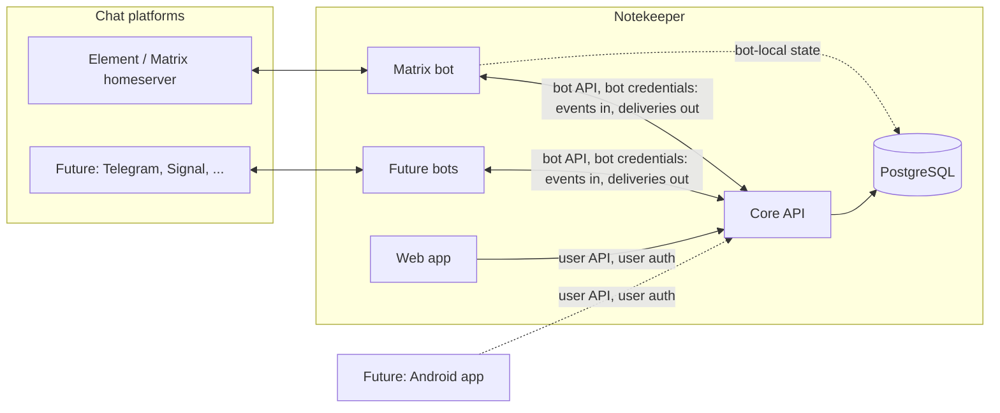

# Notekeeper — Requirements

Status: draft v0.2 — requirements only. Technology choices appear only where a constraint forces them (Postgres, Kubernetes, Matrix E2EE, native-client auth).

Priorities: **Must** / **Should** / **Could**. Every requirement also has a **State**: `unimplemented`, `implemented` or `fully tested` (implemented and covered by automated tests that demonstrate the requirement). All requirements start as `unimplemented`; the state is updated in the same commit that changes the implementation or its tests. Requirement IDs are stable identifiers; gaps in numbering are intentional (removed requirements are not renumbered). Decisions taken after review are logged in §13.

## 1. Purpose and vision

Today, notes-to-self (todo lists, reminders, concert tickets, links, ...) are sent to a private Matrix room using Element. It is the lowest-friction capture method: it is installed on every device and needs no extra thought.

Notekeeper keeps that **capture flow** and adds a place to **organise** what was captured:

1. The user sends a message to a chat bot, exactly as they do today.
2. The bot forwards it to the user's Notekeeper account, where it lands as a note in an **Inbox** ("uncategorized").
3. In the web app the user sorts notes into **categories** (columns) on **pages** by dragging, and dismisses notes once done. Dismissed notes can be restored.

Guiding principles:

- **Capture stays effortless.** The chat side must never require more effort than it does today. All organisation happens later, in the app.
- **Chat apps are interchangeable inputs.** Matrix is first, but the system must not be shaped around it.
- **The API is the product.** The web app, bots and a future Android client are all clients of one API.

## 2. Scope

### 2.1 In scope (v1)

- A backend service (the **Core**) that owns all data and business rules.
- A **web app** for organising notes.
- A generic **bot integration contract** and one implementation: a **Matrix bot**.
- User accounts, authentication, and linking of chat identities to accounts.
- Deployability on Kubernetes with PostgreSQL as the only stateful dependency, documented with example manifests.
- **Global search** over all of a user's notes.
- **Reminders** on notes, delivered to the user's chat through the bots and shown in the app (Should; see §4.6).
- **Administration**: a single admin who creates accounts and registers bots.

### 2.2 Out of scope for v1 (but must not be precluded)

- Android client (see §9) and any other native client.
- Additional bots (Telegram, Signal, WhatsApp, e-mail, ...).
- Browser/mobile push notifications (reminders are delivered in chat and in-app only).
- Sharing notes or pages between users, collaboration.
- Checklists as a structured note type (todo lists are plain text for now).
- End-to-end encryption of notes at rest inside Notekeeper.
- Offline editing (but the API must be sync-friendly, see NFR-API).
- External identity providers (OIDC/SSO) and anything depending on outbound e-mail: authentication is local passwords only.
- Import of chat history: only messages sent after linking are captured.
- Group / multi-person chat rooms: bots work in direct messages only.
- Choosing a page/category from chat: every note lands in the Inbox.
- Undo of anything but dismissal (earlier text versions are recoverable from note history instead).
- Automatic purging of the Trash: dismissed notes are kept until the user deletes them permanently.
- A packaged Helm chart or operator: example Kubernetes manifests are enough.
- Localised UI/bot messages (English only in v1; Dutch can follow).
- Object storage for attachments (not available now; the storage layer must allow adding it later).

### 2.3 Glossary

| Term | Meaning |
|---|---|
| **User** | A Notekeeper account holder. |
| **Note** | The unit of content: text and/or attachments, plus metadata. Lives in exactly one place: the Inbox or one category. |
| **Note part** | One contribution to a note, usually one chat message (a text or a file). A note consists of one or more ordered parts. |
| **Inbox** | The per-user "uncategorized" holding area. New notes always start here. |
| **Page** | A user-defined board (e.g. "Work", "Chores"). Contains categories. |
| **Category** | A user-defined column on a page. Contains notes. |
| **Trash** | Dismissed (soft-deleted) notes. |
| **Bot** | A service that connects one chat platform to Notekeeper. |
| **Bot instance** | One deployed, credentialed bot (e.g. "my Matrix bot on homeserver X"). |
| **External identity** | A user's identity on a chat platform (e.g. `@robin:example.org`). |
| **Source reference** | The bot instance + conversation + message ID a note part originated from. |
| **Admin** | The single user who administers the deployment (creates accounts, registers bots). Also a normal user. |
| **Activation link** | Single-use, expiring link handed to a new user (or a user who lost their password) to set their own password. |
| **Reminder** | A point in time at which a note should nudge the user. |
| **Delivery** | A queued outbound message from Core to a user through a bot instance (e.g. a due reminder). |

## 3. System overview

**Components**

| Component | Responsibility |
|---|---|
| **Core** | Single source of truth. Users, auth, pages/categories/notes, trash, attachments, message grouping and edit handling, global search, reminder scheduling and the outbound delivery queue, realtime change feed. Exposes the public HTTP API. |
| **Web app** | Browser UI. A client of the user-facing API only; no privileged access. |
| **Bot(s)** | Translate between a chat platform and the bot-facing part of the Core API. Contain platform-specific logic only (protocol, encryption, message formats). They also send outbound messages (e.g. reminders) that Core queues for them. |
| **PostgreSQL** | All persistent state of Core (and any durable state the bots need). |

**Key design decision — where does "smart" logic live?** Grouping of messages into notes, edit propagation and deduplication live in the **Core**, not in the bots. Bots forward normalised events and platform hints (replies, threads, edits, timestamps); Core decides what they mean. This keeps behaviour consistent across chat platforms and keeps bots thin, so adding a bot is cheap. Likewise Core decides *when* a reminder fires and *to whom*; the bot only delivers it.

## 4. Core

### 4.1 Domain model (conceptual)

- A **User** owns Pages, Categories, Notes, Attachments, linked External identities and Bot links.
- A **Page** has an ordered list of **Categories**. Pages themselves are ordered.
- A **Note** belongs to the Inbox (no category) or to exactly one Category, at an explicit position. It has a state: `active` or `deleted`.
- A **Note** has one or more ordered **Note parts**. Each part is text and/or an attachment, and optionally has a **Source reference**.
- **Attachments** are binary blobs (images, PDFs, ...) with filename, media type, size.
- A note part keeps a **version history** of its text (EDT-3).
- A **Reminder** belongs to a note; when due it produces **Deliveries** (§4.6), each addressed to a channel of the user.
- A **Bot instance** is registered by the admin; a **Link** binds one external identity on a bot instance to one user (§5.3).
- All entities have stable, globally unique, client-generatable IDs (UUIDs), creation/modification timestamps and a version counter.

### 4.2 Notes — functional requirements

| ID | Pri | State | Requirement |
|---|---|---|---|
| CORE-N1 | Must | unimplemented | Notes are created with text and/or attachments. A note always has at least one part. |
| CORE-N2 | Must | unimplemented | New notes created via a bot are placed in the Inbox of the linked user, at the top. |
| CORE-N3 | Must | unimplemented | A note can be moved to any category of any of the user's pages, at a chosen position, or back to the Inbox. |
| CORE-N4 | Must | unimplemented | Note order within a category / the Inbox is user-controlled and persistent. |
| CORE-N5 | Must | unimplemented | Note text can be edited in the app. Text supports lightweight formatting (Markdown subset) and auto-linked URLs. |
| CORE-N6 | Must | unimplemented | Deleting ("dismissing") a note is a **soft delete**: state becomes `deleted`, `deleted_at` is set, and the note remembers its previous location. |
| CORE-N7 | Must | unimplemented | A deleted note can be **restored** to its previous location; if that category no longer exists, it is restored to the Inbox. |
| CORE-N8 | Must | unimplemented | Undo of a dismissal is a server-side restore, so it works from any device and from the Trash view, not just as a transient client-side action. |
| CORE-N9 | Must | unimplemented | Deleted notes can be listed (Trash), newest-deleted first, with their previous page/category shown. |
| CORE-N10 | Must | unimplemented | Permanently deleting a note (and its attachments) from the Trash on explicit user action. Required because Trash content counts toward the user's storage quota (CORE-A3). |
| CORE-N11 | Must | unimplemented | Trash retention is unlimited: dismissed notes are kept until the user permanently deletes them. There is no automatic purge. |
| CORE-N13 | Must | unimplemented | **Global full-text search** over all of a user's notes across every page, category and the Inbox (Trash on request): note text and attachment filenames. Case- and diacritic-insensitive, prefix matching, and correct for **English** (inflections and plurals, e.g. "ticket"/"tickets"). Further languages, Dutch first, can be added later without changing the API; language is not a per-note setting the user has to maintain. Typo tolerance is a Should. Ranked by relevance, recency as tie-breaker. The index lives in PostgreSQL (NFR-D2) and is updated transactionally with the note, so a note that just arrived from chat or was just edited is immediately searchable. |
| CORE-N14 | Should | unimplemented | Manually **merge** two notes and **split** a part out of a note, to correct wrong automatic grouping (see §6.3). |
| CORE-N15 | Could | unimplemented | Bulk operations (dismiss/move multiple notes). |
| CORE-N16 | Could | unimplemented | Search inside attachment contents (PDF text layer, OCR of images), e.g. to find a ticket by event name. |

### 4.3 Pages and categories — functional requirements

| ID | Pri | State | Requirement |
|---|---|---|---|
| CORE-P1 | Must | unimplemented | Users can create, rename, reorder and delete pages. |
| CORE-P2 | Must | unimplemented | Users can create, rename, reorder and delete categories within a page. |
| CORE-P3 | Must | unimplemented | Categories can be moved to another page. |
| CORE-P4 | Must | unimplemented | Deleting a category never destroys notes: its notes are moved to the Inbox (and the user is told how many). Deleting a page does the same for all its categories. |
| CORE-P5 | Must | unimplemented | A new account starts with an empty Inbox and no pages; the UI guides the user to create the first page. |
| CORE-P6 | Could | unimplemented | Archive a page (hidden from the main navigation, not deleted). |
| CORE-P7 | Could | unimplemented | Per-category colour/icon. |

### 4.4 Attachments

| ID | Pri | State | Requirement |
|---|---|---|---|
| CORE-A1 | Must | unimplemented | Attachments are stored by Core and served only to the owning user (authenticated, authorised requests; no public or guessable URLs). |
| CORE-A2 | Must | unimplemented | Attachment storage sits behind a storage-backend interface (write stream, read stream with byte ranges, delete, size). v1 has exactly one backend: **PostgreSQL** (no object storage is available). The backend is recorded per attachment, so a second backend (e.g. S3-compatible) can be added later, and existing blobs moved, without changes to the API or note data model. |
| CORE-A3 | Must | unimplemented | Configurable maximum attachment size (default: 25 MiB) and per-user storage quota (deployment default, adjustable per user by the admin; Trash counts toward it). Violations produce a clear error that the bot can relay to the user. |
| CORE-A4 | Must | unimplemented | Attachments keep filename and media type. Images get generated thumbnails/previews for the UI. |
| CORE-A5 | Should | unimplemented | Deduplicate identical blobs per user (content hash). |
| CORE-A6 | Should | unimplemented | Uploads and downloads are streamed/chunk-friendly so large files do not need to be fully buffered in memory. |
| CORE-A7 | Should | unimplemented | An operator tool moves blobs between storage backends online, without downtime or API changes. |
| CORE-A8 | Must | unimplemented | The PostgreSQL backend must: stream uploads and downloads with memory bounded independently of file size; support random access for range requests; tie blob lifetime transactionally to its attachment (no orphaned blobs after deletion or a failed upload); be covered by standard PostgreSQL backup/restore (dump, PITR, replication); and work behind a connection pooler and on managed PostgreSQL. *Design note, to confirm at design time:* chunked rows in an ordinary table are preferred over PostgreSQL Large Objects (cascading delete, no orphan cleanup, logical-replication and pooler friendly); Large Objects are acceptable only if every requirement above demonstrably holds. |

### 4.5 Realtime and sync

| ID | Pri | State | Requirement |
|---|---|---|---|
| CORE-S1 | Must | unimplemented | Clients see changes made elsewhere (new note from a bot, edit, move on another device) without manual reload (push channel such as SSE or WebSocket). |
| CORE-S2 | Must | unimplemented | Realtime delivery works with multiple Core replicas (no in-process-only pub/sub). |
| CORE-S3 | Must | unimplemented | A **change feed** endpoint returns all changes (including deletions/tombstones) since an opaque cursor, so clients can (re)sync incrementally after being offline or reconnecting. |
| CORE-S4 | Must | unimplemented | Mutations carry the version the client based them on. For content (note text) **the latest edit wins**: nothing is lost because every overwritten text version is kept in the note's history (EDT-3), and a client whose base version was stale is told, so it can show that the note changed. Structural operations (move, reorder, dismiss, restore) are applied so that two devices working on different notes never conflict. |
| CORE-S5 | Must | unimplemented | Mutating requests accept an idempotency key or client-generated ID so retries are safe. |

### 4.6 Reminders (Should)

A reminder makes a note nudge the user at a chosen time. Core sends it to the user's chat through a bot and shows it in the app. Reminders are a Should for v1 (built after the capture/organise core, but including recurrence and chat commands), but the outbound part of the bot contract (BOT-11..13) is designed from the start so nothing has to be reworked.

| ID | Pri | State | Requirement |
|---|---|---|---|
| CORE-R1 | Should | unimplemented | A note can have one or more reminders, each an absolute point in time. Reminders are created, changed and cleared in the app (WEB-18). |
| CORE-R2 | Should | unimplemented | Each user has an IANA timezone (defaulted from the browser at first login) used to interpret quick options such as "tomorrow morning" and to display times. Stored instants are unambiguous and correct across daylight-saving changes. |
| CORE-R3 | Should | unimplemented | When a reminder is due, Core queues a **delivery** for every channel the user enabled for reminders: each linked chat identity marked as reminder target, plus the in-app notification. Default: the first linked chat identity; in-app only if none is linked. |
| CORE-R4 | Should | unimplemented | Deliveries are durable (stored in PostgreSQL before sending), at-least-once, and retried with backoff on transient failure. They are never dropped because a bot is temporarily down: they are sent as soon as it is back and flagged as late (e.g. more than 5 minutes past due). |
| CORE-R5 | Should | unimplemented | Scheduling holds no in-process timers: any Core replica can fire due reminders and each reminder is claimed by exactly one (e.g. row-level claiming with `SKIP LOCKED`). Target: p95 within 60 s of the due time when the channel is available. |
| CORE-R6 | Should | unimplemented | A reminder message contains the note text (truncated), a deep link to the note in the web app, and the note's **attachments are re-sent** into the chat (e.g. the ticket PDF), so the note's content is usable from the chat alone. If an attachment cannot be sent (too large for the platform, platform error), the message falls back to naming it and linking to the note; a failed attachment never blocks the reminder text. |
| CORE-R7 | Should | unimplemented | Dismissing a note suspends its pending reminders. Restoring it re-arms those still in the future; reminders that came due while it was dismissed are not sent. |
| CORE-R8 | Should | unimplemented | A reminder can be snoozed (preset durations) or marked done from the app. Fired reminders remain visible on the note (e.g. "reminded Fri 09:00"). |
| CORE-R9 | Should | unimplemented | In-app: due reminders show as a notification indicator, and the user can see a list of upcoming reminders. |
| CORE-R10 | Should | unimplemented | **Recurring reminders** (daily, weekly, monthly, custom interval, optionally on chosen weekdays). Recurrence is evaluated in the user's timezone, so "09:00" stays 09:00 across daylight-saving changes. Occurrences missed during an outage collapse into one late delivery rather than a burst. A recurring reminder can be ended or skipped once. |
| CORE-R11 | Should | unimplemented | **Reminder actions from chat.** (a) `!remind <when>` as a reply to a message that belongs to a note sets a reminder on that note; (b) `!remind <when> <text>` creates a new Inbox note with that text and a reminder; (c) replying to a reminder message with `!snooze <duration>` snoozes it, and `!done` marks it done. Time expressions are understood in **English** (e.g. "tomorrow 9am", "in 2 hours", "friday 18:30") relative to the user's timezone. If the expression cannot be understood, nothing is created and the bot replies with what went wrong and an example. Ordinary messages never create reminders, so plain capture is unchanged. |
| CORE-R12 | Could | unimplemented | Browser/mobile push notifications for in-app reminders (Web Push, later FCM). |
| CORE-R13 | Should | unimplemented | Reminder time expressions are parsed by Core (not by the bots), so behaviour is identical across chat platforms and covers all supported languages in one place (English in v1). |

## 5. Accounts and authentication

### 5.1 Users and accounts

| ID | Pri | State | Requirement |
|---|---|---|---|
| AUTH-U1 | Must | unimplemented | The system supports multiple users with strict data isolation. Every data access is scoped to the authenticated user; this is enforced centrally, not per endpoint by convention. |
| AUTH-U2 | Must | unimplemented | A user account has: unique ID, unique **username** (login identifier), display name, optional e-mail (informational only; no feature depends on e-mail delivery), created timestamp, status (active/disabled). |
| AUTH-U3 | Must | unimplemented | Sign-up is **closed**, always: there is no self-registration. Accounts are created only by the admin (AUTH-U6). |
| AUTH-U4 | Must | unimplemented | Users can change their password, view and revoke active sessions/devices, and delete their account (deleting all data, including attachments). |
| AUTH-U5 | Should | unimplemented | Users can export all their data (notes, pages, attachments) in an open format. |
| AUTH-U6 | Must | unimplemented | The **admin** can, in the web app (WEB-19) and via the API: create users; issue an activation link for a user (new account or lost password); disable/enable a user; delete a user together with all their data; set a user's storage quota; see per-user storage usage; register and disable bot instances and rotate their credentials. No app feature lets the admin read other users' notes. |
| AUTH-U7 | Must | unimplemented | There is **exactly one admin**. The admin is bootstrapped at first start (from configuration/secret or an operator CLI command) and is otherwise a normal user with their own notes, pages and links. The single-admin rule is enforced by the data model, not only the UI, and the admin role cannot be granted through the API. Changing who the admin is, or recovering a lost admin password, is an operator action (CLI) — Should. |
| AUTH-U8 | Must | unimplemented | **Account activation without e-mail.** A newly created account has no password until the person opens the single-use, expiring (e.g. 7 days) activation link, which the admin hands over out-of-band, and sets their own password. The admin never sees or sets user passwords. A forgotten password is handled the same way: the admin issues a new link, which also revokes the user's existing sessions. |

### 5.2 Authenticating users (web now, Android later)

| ID | Pri | State | Requirement |
|---|---|---|---|
| AUTH-C1 | Must | unimplemented | Local authentication with username + password only; no external identity providers and no dependency on e-mail infrastructure. Passwords are stored only as salted hashes using a modern password hash (e.g. argon2id); a minimum length is enforced. |
| AUTH-C3 | Must | unimplemented | The auth mechanism is suitable for both browsers and native mobile apps: short-lived access tokens plus revocable, rotating refresh tokens, obtained via a standard flow (OAuth 2.0 authorization code + PKCE against Core's own login page, so a native client never handles the password). No design that only works with browser cookies. |
| AUTH-C4 | Must | unimplemented | Web sessions are protected against CSRF and XSS-based token theft (e.g. HttpOnly, SameSite cookies or equivalent), and all traffic is over TLS. |
| AUTH-C5 | Must | unimplemented | Auth state is not held in Core process memory: any replica can serve any request (sessions/refresh tokens live in Postgres or are self-contained signed tokens with a revocation mechanism). |
| AUTH-C6 | Must | unimplemented | Login is rate-limited and brute-force resistant. |
| AUTH-C7 | Should | unimplemented | TOTP or passkey as a second factor. |
| AUTH-C8 | Could | unimplemented | Personal access tokens for scripts/automation, scoped and revocable. |

### 5.3 Authenticating bots and linking chat identities

Bots are **not users** and do not hold user passwords. There are two separate concerns:

1. **Bot instance authentication** — proving to Core that a request comes from a trusted bot deployment.
2. **Identity linking** — mapping a chat identity (e.g. Matrix ID) to exactly one Notekeeper user, with that user's consent.

| ID | Pri | State | Requirement |
|---|---|---|---|
| AUTH-B1 | Must | unimplemented | A **bot instance** is registered in Core by the admin with a type (`matrix`, ...), a name, and a rotatable credential (client ID + secret, or equivalent). Credentials are stored hashed; multiple credentials can be valid during rotation. There is no limit on the number of bot instances, of any type. One bot instance serves any number of users, and one user can be linked to any number of bot instances. |
| AUTH-B2 | Must | unimplemented | Bot credentials carry narrow scopes (e.g. `bot:ingest`, and `bot:deliver` for outbound deliveries) that permit only the bot-facing API. They can never call user-facing endpoints, and a bot can act only for users who have **linked** an external identity to that bot instance. |
| AUTH-B3 | Must | unimplemented | **Linking flow**: (a) the user, logged in to the web app, requests a link for a bot type/instance and receives a short-lived (e.g. 10 min), single-use pairing code; (b) the user sends that code to the bot in chat (e.g. `!link <code>`); (c) the bot submits the code plus the sender's external identity to Core; (d) Core binds the external identity to the user and the bot replies with a confirmation. |
| AUTH-B4 | Must | unimplemented | An external identity (`bot type` + `platform user ID`, e.g. homeserver-qualified) maps to at most one Notekeeper user. A user may link many external identities, across many bot instances and platforms. |
| AUTH-B5 | Must | unimplemented | Users can list and revoke their links in the web app. Revocation takes effect immediately; further messages from that identity are rejected and the bot tells the sender the identity is unlinked. Notes already created stay; later edits/deletes arriving from a revoked identity are ignored. |
| AUTH-B6 | Must | unimplemented | Messages from unlinked identities are never stored. The bot replies once (rate-limited) with linking instructions. |
| AUTH-B7 | Must | unimplemented | Ingest requests are attributed: every note part records which bot instance and external identity created it. |
| AUTH-B8 | Should | unimplemented | Audit log of bot-related security events (link created/revoked, credential rotated, rejected requests). |
| AUTH-B9 | Could | unimplemented | Alternative to a shared bot service: per-user, per-bot revocable tokens (useful for very simple bots/scripts). The ingest API should be usable that way with no changes beyond auth. |

## 6. Bot integration contract (platform-independent)

This is the part that makes adding a second chat app cheap. A bot only needs to implement this contract; it never touches the database of Core.

### 6.1 Bot-facing API — functional requirements

| ID | Pri | State | Requirement |
|---|---|---|---|
| BOT-1 | Must | unimplemented | Core exposes a versioned, documented (OpenAPI) bot-facing API separate from the user-facing one, using bot credentials (AUTH-B1/B2). |
| BOT-2 | Must | unimplemented | **Identity resolution / linking**: redeem pairing code for an external identity; look up whether an external identity is linked (needed to decide between "ingest" and "send linking instructions"). |
| BOT-3 | Must | unimplemented | **Message events**: the bot reports normalised events, each carrying: bot instance, external identity of the sender, conversation ID, platform message ID, platform timestamp, and the event kind: `message_created`, `message_edited` (references original message ID + new content), `message_deleted`. |
| BOT-4 | Must | unimplemented | A message event's content is a list of typed parts: `text` (plain text or Markdown), `attachment` (see BOT-6), or `unsupported` (fallback text description, e.g. "location shared"). |
| BOT-5 | Must | unimplemented | Events include **relationship hints** when the platform provides them: "replies to message X", "in thread T". Core uses them for grouping (§6.3). |
| BOT-6 | Must | unimplemented | Attachment upload: the bot uploads binary content (already decrypted, if the platform encrypts it) with filename and media type, and refers to it from the message event. Uploads are resumable/streamed. |
| BOT-7 | Must | unimplemented | **Idempotent ingestion**: the tuple (bot instance, conversation, platform message ID, event kind/edit ID) is a natural dedupe key. Replaying an event is safe and yields the same result. Delivery is at-least-once. |
| BOT-8 | Must | unimplemented | Core's response to an event tells the bot what happened (note created / appended to note / updated / ignored / rejected + reason), so the bot can give feedback in chat. The response also carries a short human-readable message (English in v1, localisable per NFR-Q3) for anything the bot needs to say in chat, so bots contain no user-facing wording of their own. |
| BOT-9 | Must | unimplemented | Events for one conversation are delivered by the bot in platform order. Core is nonetheless tolerant: an edit or delete for an unknown message is ignored (or parked briefly), not an error that blocks the bot. |
| BOT-10 | Should | unimplemented | Core's notion of "what the bot has already delivered" (e.g. last platform timestamp per conversation) is queryable, so a bot that lost its own state can resync. |
| BOT-11 | Should | unimplemented | **Delivery API (Core → bot, pull-based).** A bot fetches the queued outbound deliveries addressed to its bot instance (long-poll or streaming), claims each with a lease, and reports the outcome: delivered, failed-transient, or failed-permanent with a reason. Unclaimed or lease-expired deliveries are offered again. Pull-based so bots need no inbound network exposure and Core needs no bot addresses. Required for reminders (§4.6). |
| BOT-12 | Should | unimplemented | A delivery names its target: external identity plus conversation ID. Core learns the conversation from linking and message events (BOT-2/BOT-3) and keeps the most recent direct-message conversation per identity. |
| BOT-13 | Should | unimplemented | Each delivery has a unique ID, which the bot uses to make sending idempotent where the platform allows (e.g. a Matrix transaction ID), so a restart between sending and acknowledging does not visibly duplicate the message. After sending, the bot reports the platform message ID(s) it created, so that a user's reply to a reminder (`!snooze`, `!done`) can be mapped back to that delivery. |
| BOT-14 | Should | unimplemented | **Command events.** Beyond `link`/`unlink`/`help`, the bot forwards recognised chat commands (`remind`, `snooze`, `done`) to Core as platform-neutral command events: command name, raw argument text, sender identity, conversation, and the replied-to message ID. Core interprets them and returns the outcome plus a localised reply text for the bot to show. |
| BOT-15 | Should | unimplemented | **Attachment download for deliveries.** A delivery lists its attachments (filename, media type, size) and the bot can download them through the bot API, but only attachments referenced by deliveries addressed to that bot instance; bot credentials never grant general read access to a user's attachments (AUTH-B2). |

### 6.2 Bot behaviour requirements (all bots)

| ID | Pri | State | Requirement |
|---|---|---|---|
| BOT-B1 | Must | unimplemented | Bots are thin: no note logic, no categorisation, no grouping decisions. |
| BOT-B2 | Must | unimplemented | Bots must not lose messages: after downtime or restart they catch up on messages sent meanwhile (using the platform's sync mechanism plus their durable cursor) and rely on idempotent ingestion for duplicates. |
| BOT-B3 | Must | unimplemented | Feedback in chat is minimal and low-noise. Preferred default: a reaction/tick on the original message on success, a short reply on failure or when the identity is unlinked. Users can silence success feedback. |
| BOT-B4 | Must | unimplemented | Bots are horizontally safe: running two replicas by mistake must not double-create notes (dedupe by BOT-7) — although a single active replica / leader election per bot instance is acceptable. |
| BOT-B5 | Must | unimplemented | Bots persist any durable state they need (sync cursors, platform crypto keys) in PostgreSQL or another declared durable store, never on ephemeral container storage. |
| BOT-B6 | Should | unimplemented | Bots expose health, readiness and metrics endpoints and structured logs. |

### 6.3 Message → note grouping (owned by Core)

Goal: what the user perceives as *one* piece of information becomes *one* note, even if the chat platform produces several messages for it (e.g. Element sends a file as its own message, separate from its caption/text).

**Definitions**: a message is *media-only* if it contains attachments and no text; *text-only* if it has text and no attachments.

| ID | Pri | State | Requirement |
|---|---|---|---|
| GRP-1 | Must | unimplemented | **Explicit relations win.** A message that replies to a message already belonging to a note, or is in a platform thread that belongs to a note, is appended to that note as a new part. This is the deterministic way for a user to say "this belongs together", and it works at any time (not limited by a time window). |
| GRP-2 | Must | unimplemented | **Media adjacency.** Absent an explicit relation, a message is grouped with the sender's adjacent message in the same conversation when it falls within the **grouping window**, in either direction: (a) a *media-only* message is merged into the sender's previous note in that conversation if that note's last part is within the window and adding it does not violate GRP-4; (b) a *text-only* message is merged into the sender's previous media-only note if that note's last part is within the window and it has no text yet. |
| GRP-3 | Must | unimplemented | Consecutive **media-only** messages (e.g. several photos/pages sent in a burst) within the window form one note. |
| GRP-4 | Must | unimplemented | Two separate **text-only** messages are *not* merged by timing alone — quickly sent todo items must stay separate notes. A note receives at most one auto-grouped text body (a caption before or after the media); further text needs an explicit relation (GRP-1). |
| GRP-5 | Must | unimplemented | The grouping window is measured from the last part added to the note, is configurable (deployment default, per-user override), and defaults to a short period (proposed: 60 seconds). The window is evaluated on **platform event timestamps**, not arrival time, so a burst delivered after bot downtime is grouped exactly as it would have been live. |
| GRP-6 | Must | unimplemented | The note is created immediately on the first message (no waiting for a possible companion) and **updated in place** as related messages arrive. Users see the note in the Inbox instantly; realtime updates (CORE-S1) make later parts appear. |
| GRP-7 | Must | unimplemented | Auto-grouping (GRP-2..4) only ever targets `active` notes. A deleted note never receives auto-grouped parts; a new note is created instead. An explicit relation (GRP-1) to a message of a deleted note also creates a new note, which records the relation. |
| GRP-8 | Must | unimplemented | Grouping decisions are deterministic and explainable: each part records why it was attached (`first`, `reply`, `thread`, `media-adjacency`). |
| GRP-9 | Should | unimplemented | The grouping policy is an isolated, replaceable module (strategy) so it can be tuned without touching bots or API contracts. |
| GRP-10 | Should | unimplemented | Users can fix wrong outcomes afterwards by merging/splitting in the app (CORE-N14). |
| GRP-11 | Could | unimplemented | Optional chat-side override, e.g. a command or marker that forces "new note" or "start a batch of several messages". |

### 6.4 Edits and deletions from the chat side (owned by Core)

| ID | Pri | State | Requirement |
|---|---|---|---|
| EDT-1 | Must | unimplemented | Every note part created from a chat message stores its source reference, so later events can find it. |
| EDT-2 | Must | unimplemented | When the chat message is **edited**, the corresponding note part is updated in place; the note's modification time changes and clients are notified (CORE-S1). For text parts, the new text replaces the old text. |
| EDT-3 | Must | unimplemented | Every version of a part's text is retained with timestamp and origin (chat or app), for chat edits and app edits alike, so that under latest-wins nothing is irrecoverably lost. History is viewable and restorable in the app (WEB-13). |
| EDT-4 | Must | unimplemented | When the chat message is **deleted/redacted** on the platform, the part is removed from the note. If it was the last part, the note is moved to the Trash (not permanently deleted). |
| EDT-5 | Must | unimplemented | **The latest edit wins**, regardless of origin: a chat edit replaces the part's text even if it was edited in the app before, and vice versa. "Latest" is when the edit was *made* (platform event timestamp for chat edits, server time for app edits), not when it arrives: a chat edit delivered late (e.g. after bot downtime) that is older than the part's last app edit goes into history only and does not overwrite. Clocks are assumed reasonably synchronised. |
| EDT-6 | Must | unimplemented | Edits/deletes of messages that Core does not know (sent before linking, ignored, unsupported) are ignored without error. |
| EDT-7 | Must | unimplemented | Edits and deletes apply also to notes in the Trash or in categories (the note stays where it is). |
| EDT-8 | Should | unimplemented | Edit events that arrive for a message which changed its attachments (where the platform allows it) update/replace the attachment part consistently. |

## 7. Matrix bot

### 7.1 Functional requirements

| ID | Pri | State | Requirement |
|---|---|---|---|
| MX-1 | Must | unimplemented | The bot has its own Matrix account on a configured homeserver. It works in **direct-message rooms only**: rooms with exactly two joined members, the bot and one user. Group rooms are out of scope. |
| MX-2 | Must | unimplemented | The bot accepts invites to direct-message rooms only (rate-limited) and declines other invites. If a third member joins a DM room, the bot stops processing it and says so once. Messages are processed only from linked identities; unlinked users receive linking instructions (AUTH-B6). |
| MX-3 | Must | unimplemented | **End-to-end-encrypted rooms must work**, since Element creates encrypted DMs by default: the bot participates in Olm/Megolm, verifies/cross-signs as needed, decrypts messages and encrypted attachments (`m.file` / `m.image` / `m.audio` / `m.video` with encryption info), and handles key requests/backfill. |
| MX-4 | Must | unimplemented | Message types handled: `m.text`, `m.notice` (ignored — used by the bot itself), `m.emote` (treated as text), `m.image`, `m.file`, `m.audio`, `m.video`, `m.location` (as a text/link part). Unknown types become `unsupported` parts with a description rather than being dropped. |
| MX-5 | Must | unimplemented | Formatted messages (`formatted_body` HTML) are converted to the Core's text format (Markdown subset); plain `body` is the fallback. Captions on media (`filename` + `body` semantics) are recognised so caption + file arrive as one message with two parts. |
| MX-6 | Must | unimplemented | Edits (`m.replace` relations) map to `message_edited`; redactions map to `message_deleted`. Replies (`m.in_reply_to`) and threads (`m.thread`) map to relationship hints (BOT-5). |
| MX-7 | Must | unimplemented | Feedback: a reaction on the source message on success (default ✅); a short text reply for errors (unlinked, too large, quota) — see BOT-B3. |
| MX-8 | Must | unimplemented | Commands are minimal and unambiguous: `!link <code>`, `!unlink`, `!help`; with reminders also `!remind`, `!snooze`, `!done` (CORE-R11, BOT-14). Everything else is a note. A message starting with a command prefix that is not a known command is treated as a note (nothing is ever silently swallowed). A known command with invalid arguments is answered with an error and never turns into a note. |
| MX-9 | Must | unimplemented | Catch-up after downtime via the Matrix sync token stored durably (BOT-B2, BOT-B5). |
| MX-10 | Must | unimplemented | Only messages sent after the identity was linked (or after the bot joined the room, whichever is later) are processed. History import is out of scope: older room history is never backfilled into notes. |
| MX-11 | Could | unimplemented | Support for bot-side "typing"/read-receipt to signal processing, if it reduces uncertainty for the user. |
| MX-12 | Should | unimplemented | **Reminder delivery** (BOT-11..15): the bot posts the reminder as a message in the linked DM (plain text plus formatted body, with the deep link), then re-sends each attachment as Matrix media (encrypted upload in encrypted rooms), falling back to a name plus link if the homeserver refuses it. It derives the Matrix transaction ID from the delivery ID, reports the sent event IDs (BOT-13), and reports a permanent failure if the room is gone or the user has left. |

### 7.2 Matrix-specific non-functional requirements

| ID | Pri | State | Requirement |
|---|---|---|---|
| MX-N1 | Must | unimplemented | Cryptographic device keys and session state are persisted durably (Postgres) and encrypted at rest with a key from a Kubernetes secret. Losing the pod must not lose the device identity, or messages in encrypted rooms would become undecryptable. |
| MX-N2 | Must | unimplemented | Uses a single active instance per Matrix bot account (one device identity); a rolling update must not run two active instances that would fight over the same device keys (e.g. `Recreate` strategy or leader lock in Postgres). |
| MX-N3 | Must | unimplemented | Works against any spec-compliant homeserver (Synapse, Conduit, Dendrite, matrix.org); homeserver URL and credentials are configuration. |

## 8. Web app

### 8.1 Views and functionality

| ID | Pri | State | Requirement |
|---|---|---|---|
| WEB-1 | Must | unimplemented | **Page view**: shows the selected page's categories as horizontally arranged columns of note cards. |
| WEB-2 | Must | unimplemented | **Inbox**: the uncategorised notes are always reachable from any page (e.g. a persistent side panel or tray) so notes can be dragged straight from the Inbox into a column of the current page. The Inbox has a visible count. |
| WEB-3 | Must | unimplemented | **Drag and drop**: a note can be dragged between columns (also across the Inbox), and reordered within a column. The UI updates immediately (optimistic) and reconciles with the server. |
| WEB-4 | Must | unimplemented | Moving a note to a category on **another page** is possible (e.g. via a "move to..." menu; dragging onto a page in the navigation is a nice extra). |
| WEB-5 | Must | unimplemented | Every drag-and-drop action has a **non-drag alternative** (keyboard and menu "move to...") for accessibility and for touch devices where drag is awkward. |
| WEB-6 | Must | unimplemented | **Dismiss** button on every note (one click, no confirmation dialog), followed by a transient **Undo** affordance (toast) of at least ~10 seconds. |
| WEB-7 | Must | unimplemented | **Trash view**: list of deleted notes with restore and permanent-delete actions (CORE-N10), and indication of where each came from. |
| WEB-8 | Must | unimplemented | Notes render: text (formatted, links clickable), image attachments as thumbnails with a viewer, other attachments as downloadable items (filename, size, type), creation time and origin ("via Matrix"). Notes with several parts render as one card. |
| WEB-9 | Must | unimplemented | Notes can be edited inline (text) and attachments can be added/removed manually in the app. New notes can also be created directly in the app. |
| WEB-10 | Must | unimplemented | Page and category management (create, rename, reorder, delete) with clear feedback about what happens to contained notes (CORE-P4). |
| WEB-11 | Must | unimplemented | Live updates: a note arriving from a bot appears in the Inbox within seconds, without reload, including when the user is mid-drag or editing (no jarring reflow of what is being edited). |
| WEB-12 | Must | unimplemented | Account settings: password, sessions, linked chat identities (link/unlink via the pairing flow of AUTH-B3, and which identities receive reminders), timezone, bot status, grouping window. |
| WEB-13 | Should | unimplemented | Note history: view earlier text versions of a note (including versions overwritten by chat edits) and restore one (EDT-3). Notes changed from chat show a subtle "edited" marker. |
| WEB-14 | Must | unimplemented | **Global search**, reachable from every view (persistent search field plus keyboard shortcut): searches all pages, categories and the Inbox, optionally the Trash. Results show a snippet, where the note lives (page/category, Inbox or Trash) and its date; selecting one opens the note in place. Filters: page, category, has attachment, has reminder. Backed by CORE-N13. |
| WEB-15 | Should | unimplemented | Merge/split notes (CORE-N14). |
| WEB-16 | Should | unimplemented | Keyboard shortcuts for common actions (dismiss, move, focus Inbox). |
| WEB-17 | Could | unimplemented | Alternative layouts for a page (list, compact) — exact look is deferred (see below). |
| WEB-18 | Should | unimplemented | Reminders on notes: set, change, snooze and clear a reminder with a date/time picker and quick options; a visible indicator on cards with a pending reminder; list of upcoming reminders; in-app notification when one is due (CORE-R1..R9). |
| WEB-19 | Must | unimplemented | **Admin section**, visible only to the admin: create users and hand out activation links, disable/enable/delete users, set storage quotas, view storage usage, register bot instances and rotate their credentials (AUTH-U6). |

### 8.2 Web app non-functional requirements

| ID | Pri | State | Requirement |
|---|---|---|---|
| WEB-N1 | Must | unimplemented | **Responsive**: fully usable on a phone-sized viewport, since the app must be reachable "from every device I own". |
| WEB-N2 | Must | unimplemented | Only the public user-facing API is used, so the same functionality is available to a future Android client. |
| WEB-N3 | Must | unimplemented | Interaction feels instant: user actions are reflected within 100 ms (optimistic UI); initial page load ≤ 2 s on a typical broadband connection for a page with up to 500 notes. |
| WEB-N4 | Should | unimplemented | Accessible (WCAG 2.1 AA): keyboard operable, screen-reader labelled, sufficient contrast, respects reduced-motion and dark mode. |
| WEB-N5 | Must | unimplemented | All user-supplied content (note text, filenames, formatted chat content) is sanitised before rendering; attachments are served with safe content types and headers to prevent XSS. |
| WEB-N6 | Must | unimplemented | Supports current versions of major evergreen browsers (Firefox, Chromium-based, Safari). |
| WEB-N8 | Should | unimplemented | Installable as a PWA (manifest, service worker for the app shell), so the web app can serve as the "app" on phones until a native client exists. |
| WEB-N7 | — | — | *Exact visual design (columns vs other arrangements, theming) is intentionally undefined and will be specified separately.* |

## 9. Android client (future — constraints on the design now)

No Android requirements are in scope for v1. To keep the option open:

| ID | State | Requirement |
|---|---|---|
| AND-1 | unimplemented | All functionality is available through the public, versioned, documented API (OpenAPI); the web app has no private endpoints. |
| AND-2 | unimplemented | Native-friendly auth (AUTH-C3): OAuth 2.0 code + PKCE, refresh tokens, per-device session listing/revocation. |
| AND-3 | unimplemented | Sync-friendly API (CORE-S3, S4, S5): change feed with tombstones, stable client-generatable IDs, versions, idempotent writes — so offline-first operation can be added without redesigning the API. |
| AND-4 | unimplemented | Push updates suitable for mobile: the realtime channel (CORE-S1) works over plain HTTP(S)/WebSocket, and the design leaves room for a mobile push provider (FCM) later. |
| AND-5 | unimplemented | Attachment endpoints support range requests, conditional requests and thumbnails so they can be cached and downloaded efficiently on mobile networks. |
| AND-6 | unimplemented | A future Android **share target** ("share to Notekeeper") is just another note-creation client and needs no special backend support beyond the user-facing note-creation API (with attachments). |
| AND-7 | unimplemented | API stability policy: backwards-compatible changes only within a major version, and an explicit deprecation period, because installed mobile apps cannot be force-updated. |

## 10. End-to-end flows

**F0 — Create an account.** The admin opens Admin → Users → "New user" and enters a username → Core creates the account without a password and shows a one-time activation link → the admin sends it to the person by any channel → they open it, choose a password and land in their empty account.

**F1 — Link a chat account.** User logs in to the web app → Settings → "Connect Matrix" → sees a code → sends `!link 7GQ4-K2XM` to the bot in Element → bot redeems the code with Core, identity is linked → bot replies "Linked to your account" → the web app shows the link.

**F2 — Send a text note.** User types "buy milk, eggs" in the bot DM → bot receives it (decrypting if needed) → bot posts `message_created` to Core → Core resolves identity → creates a note in the Inbox → responds `note_created` → bot reacts ✅ → web app (open on another device) shows the note in the Inbox within seconds.

**F3 — Send a file with a caption.** User sends a PDF, then types "concert Friday" within the window. → PDF message: Core creates a note with an attachment (GRP-6) → text message: Core appends it to that note via media adjacency (GRP-2) → one card, "concert Friday" + PDF.

**F4 — Two quick todo items.** User sends "call dentist", then "renew passport" 5 s later. → Two notes (GRP-4). They can be merged manually if desired (CORE-N14).

**F5 — Edit in chat.** User edits "buy milk, eggs" to "buy milk, eggs, bread" in Element → bot posts `message_edited` → Core updates the part → note is updated everywhere. Whichever edit is latest wins (EDT-5); the earlier text stays available in the note's history (EDT-3).

**F6 — Organise.** In the web app, the user opens the "Chores" page, drags the note from the Inbox into the "This week" column. Order and location are persisted; other devices update.

**F7 — Dismiss and undo.** User clicks dismiss on a note → it disappears and a toast "Note dismissed — Undo" appears → clicking Undo restores it to its previous column and position. Later, the user opens the Trash and restores another note from last week.

**F8 — Revoke a bot link.** The user removes the Matrix link in Settings → the next message from that Matrix ID is rejected, and the bot answers with linking instructions.

**F9 — Reminder.** In the app the user sets a reminder on the "concert Friday" note for Friday 09:00 → at that time a scheduler in any Core replica claims the due reminder and queues a delivery for the user's Matrix identity → the bot, long-polling for deliveries, claims it, posts a message with the note text and a link in the DM, and reports it delivered → the app marks the reminder as sent. If the bot was down at 09:00, the message goes out when it returns, flagged as late.

**F10 — Search.** From any view the user presses the search shortcut, types "concert" → results from all pages, the Inbox (and the Trash if enabled) with their locations → selecting one opens the note in its column.

## 11. Non-functional requirements (system-wide)

### 11.1 Architecture and deployment

| ID | Pri | State | Requirement |
|---|---|---|---|
| NFR-D1 | Must | unimplemented | **Stateless services.** Core and the web frontend hold no state between requests that isn't in PostgreSQL. Any replica can serve any request; pods can be killed at any time without data loss. |
| NFR-D2 | Must | unimplemented | **PostgreSQL is the only stateful dependency** (data, attachments per CORE-A2, sessions, search index, reminder schedule and delivery queue, bot cursors/keys). No requirement for Redis, a message queue, an external search engine or persistent volumes in v1. Cross-replica coordination (realtime fan-out, locks, job claiming, reminder scheduling) uses Postgres (e.g. `LISTEN/NOTIFY`, advisory locks, `SKIP LOCKED`). |
| NFR-D3 | Must | unimplemented | Runs on Kubernetes: container images per component, configuration by environment/config files, secrets from Kubernetes Secrets, liveness/readiness/startup probes, graceful shutdown (drain in-flight requests and streams). |
| NFR-D4 | Must | unimplemented | Schema changes via versioned migrations, applied in a controlled way (init container or Job), backwards-compatible across one release so rolling updates need no downtime. |
| NFR-D5 | Must | unimplemented | Components are independently deployable and scalable: Core, web app, and each bot are separate deployables. A bot outage never affects the web app; a Core outage never loses chat messages (bots retry, chat platform retains history). |
| NFR-D6 | Should | unimplemented | **Example** Kubernetes manifests (Deployments, Services, Ingress, ConfigMap/Secret templates, migration Job, probes) that show how to run the components, plus a docker-compose setup for local development. No packaged Helm chart or operator, and no management of a complete cluster setup; the operator adapts the examples. |
| NFR-D7 | Should | unimplemented | Bots, Core and web app can be versioned and released independently (contract versioned via BOT-1). |

### 11.2 Extensibility

| ID | Pri | State | Requirement |
|---|---|---|---|
| NFR-X1 | Must | unimplemented | Adding a new chat platform requires **only** a new bot implementing the bot contract (§6) — no Core changes except registering a new bot type. |
| NFR-X2 | Must | unimplemented | Any number of bot instances per platform and platforms per user; notes record their origin (bot type/instance) so the UI can show it. |
| NFR-X3 | Should | unimplemented | Core is structured so that additional note types (checklists, reminders/due dates) can be added without breaking existing notes or clients (extensible/versioned content schema, unknown fields preserved by clients). |

### 11.3 Security and privacy

| ID | Pri | State | Requirement |
|---|---|---|---|
| NFR-S1 | Must | unimplemented | TLS for all external traffic; secrets never logged or committed; credentials stored hashed (users, bots) or encrypted (Matrix keys). |
| NFR-S2 | Must | unimplemented | Least privilege between components: bots only reach the bot-facing API (and their own durable state); Web/Android only reach the user-facing API. Network policies restrict database access to Core (and the bots for their own tables/schema). |
| NFR-S3 | Must | unimplemented | Multi-tenant isolation is tested (automated tests asserting that user A can never read/modify/enumerate user B's notes, pages, attachments or links). Consider database row-level security as defence in depth. |
| NFR-S4 | Must | unimplemented | Inputs are validated and size-limited (message length, attachments, number of parts). Rate limits on all public endpoints, with stricter limits on auth, pairing-code redemption and ingestion. |
| NFR-S5 | Must | unimplemented | **Privacy note (accepted trade-off):** notes originate from E2EE chat but are stored readable by the Notekeeper server. Documentation must state this clearly. Optional encryption at rest of attachments/DB is a Should. |
| NFR-S6 | Should | unimplemented | Audit log for security-relevant events; dependency and image vulnerability scanning in CI. |
| NFR-S7 | Must | unimplemented | Personal data handling: data export and full deletion on request (AUTH-U4/U5); logs contain no note content. |

### 11.4 Reliability and data integrity

| ID | Pri | State | Requirement |
|---|---|---|---|
| NFR-R1 | Must | unimplemented | **No note is silently lost.** After Core has acknowledged an event, it is durably stored; if Core is unavailable, bots retry with backoff and continue from their cursor. |
| NFR-R2 | Must | unimplemented | Delivery is at-least-once with idempotent handling, so duplicates never produce duplicate notes. |
| NFR-R3 | Must | unimplemented | Deleting is always soft first (Trash); nothing is permanently deleted without an explicit user action (or account deletion by the admin, AUTH-U6). |
| NFR-R4 | Must | unimplemented | Backup and restore of PostgreSQL is possible with standard tooling (e.g. `pg_dump`, WAL archiving/PITR); a restore procedure is documented and includes attachments (hence attachment storage must be part of that backup, cf. CORE-A2). |
| NFR-R5 | Should | unimplemented | Target availability for a personal/small-team deployment: ≥ 99.5 % monthly for Core; short outages are acceptable because capture is buffered by chat platforms. |

### 11.5 Performance and scale

Targets assume friends-and-family use (see §12).

| ID | Pri | State | Requirement |
|---|---|---|---|
| NFR-P1 | Must | unimplemented | Ingest latency from bot receiving a message to the note visible in the web app: p95 ≤ 3 s (excluding attachment transfer time). |
| NFR-P2 | Must | unimplemented | API read latency p95 ≤ 300 ms for standard queries (page with 500 notes, trash listing, search) at the sizing below. |
| NFR-P3 | Must | unimplemented | Sizing: up to 50 users, 50 000 notes per user (typical usage far lower), 50 GB attachments in total, with a single Postgres instance and 2 replicas of Core. |
| NFR-P4 | Should | unimplemented | Lists are paginated / lazily loaded (Trash, large categories); the change feed is paginated. |

### 11.6 Observability and operations

| ID | Pri | State | Requirement |
|---|---|---|---|
| NFR-O1 | Must | unimplemented | Structured (JSON) logs to stdout with request/correlation IDs propagated from bot → Core, so one chat message can be traced end to end. |
| NFR-O2 | Must | unimplemented | Prometheus-compatible metrics for every component (request rates and latencies, ingest outcomes, grouping decisions, reminder scheduling lag and delivery outcomes, bot lag, realtime connections, DB pool). |
| NFR-O4 | Must | unimplemented | Health endpoints distinguish *alive* from *ready* (DB reachable, migrations current). |
| NFR-O5 | Must | unimplemented | All configuration is externalised and documented; no config requires a rebuild. |

### 11.7 API and compatibility

| ID | Pri | State | Requirement |
|---|---|---|---|
| NFR-API1 | Must | unimplemented | One HTTP API described by an OpenAPI document that is the source of truth for clients (web, Android, bots); clients/SDKs can be generated from it. |
| NFR-API2 | Must | unimplemented | Versioned (major version in path or header); backwards-compatible evolution within a version; deprecation policy (see AND-7). |
| NFR-API3 | Must | unimplemented | Consistent conventions: UUID IDs, RFC 3339 UTC timestamps, cursor-based pagination, problem-details error format, idempotency keys on unsafe operations (CORE-S5). |
| NFR-API4 | Must | unimplemented | Uploads/downloads for attachments follow standard HTTP semantics (streaming, `Range`, `ETag`/conditional requests). |

### 11.8 Quality and maintainability

| ID | Pri | State | Requirement |
|---|---|---|---|
| NFR-Q1 | Must | unimplemented | Grouping and edit-handling rules (§6.3, §6.4) are covered by automated scenario tests derived from the flows in §10. |
| NFR-Q2 | Must | unimplemented | CI runs unit, integration (real PostgreSQL) and end-to-end API tests; the Matrix bot is testable against a local homeserver in CI. |
| NFR-Q3 | Should | unimplemented | The UI and everything bots say in chat are **English only** in v1, but user-facing strings are externalised (message catalogue, no hard-coded text in logic; Core supplies bot-facing text per BOT-8) and dates, times and numbers are formatted per locale, so other languages, Dutch first, can be added later without changing application logic. |
| NFR-Q4 | Should | unimplemented | Developer documentation: architecture, API, bot-writing guide (how to add a new chat platform), deployment, backup/restore. |

## 12. Assumptions

1. Users are friends and family of the operator; sign-up is closed and there is a single admin, who is also a normal user.
2. Bots are deployed by the operator. Each bot instance may serve many users; users may use many bots; users talk to bots in direct messages only.
3. A single Notekeeper deployment is operated by one party (self-hosted); there is no multi-organisation tenancy.
4. Notes are primarily text plus a few files (tickets, photos, PDFs); very large media is uncommon. Object storage is unavailable, so attachments live in PostgreSQL.
5. No e-mail sending and no identity provider are available; every flow (activation, password reset, notifications) works without them.
6. Users have reliable connectivity when organising notes; offline use is a later concern.
7. Server clocks and homeserver clocks are reasonably synchronised (NTP), which "latest edit wins" relies on.

## 13. Decisions log

Answers given after the first draft, and where they are reflected.

| # | Topic | Decision | Reflected in |
|---|---|---|---|
| 1 | Users | Friends and family, closed sign-up, single admin who creates accounts | AUTH-U3, U6, U7, U8, WEB-19, F0 |
| 2 | Inbox | One global Inbox per user | WEB-2 |
| 3 | Bots | A bot serves many users; any number of bots allowed | AUTH-B1, NFR-X2 |
| 4 | Attachment storage | PostgreSQL only for now, abstracted so object storage can be added later | CORE-A2, A7, A8 |
| 5 | Grouping | Proposed policy accepted | GRP-2..5 |
| 6 | Edit conflicts | Latest edit wins; every version kept in history | EDT-3, EDT-5, CORE-S4, WEB-13 |
| 7 | Trash | Keep forever; permanent delete on explicit action only | CORE-N10, N11 |
| 8 | History import | None | MX-10, §2.2 |
| 9 | Login | Local passwords only, no OIDC, no e-mail dependency | AUTH-C1, U8 |
| 10 | Undo | Dismissal only | CORE-N8, §2.2 |
| 11 | Search / reminders | Global search is a Must; reminders (delivered to chat and in-app) are a Should | CORE-N13, WEB-14, §4.6, BOT-11..13, MX-12 |
| 12 | Group chats | DM only | MX-1, MX-2 |
| 13 | Routing from chat | None; everything lands in the Inbox | §2.2 |
| 14 | Reminders from chat | Wanted: `!remind`, `!snooze`, `!done` (Should) | CORE-R11, R13, BOT-14, MX-8 |
| 15 | Recurring reminders | Wanted (Should) | CORE-R10 |
| 16 | Reminder targets | Each user picks reminder targets, default the first linked chat identity | CORE-R3 |
| 17 | Reminder attachments | Re-sent into the chat, with fallback to a link | CORE-R6, BOT-15, MX-12 |
| 18 | Languages | English only in v1: UI, bot messages, search and reminder time input. Dutch can be added later | CORE-N13, CORE-R11, NFR-Q3 |
| 19 | Metrics / tracing | Prometheus metrics are a Must; OpenTelemetry tracing dropped | NFR-O2 |
| 20 | Kubernetes | Example manifests are sufficient; no Helm chart, no full cluster management | NFR-D6, §2.2 |

## 14. Open questions

None at the moment. New questions will be added here as design starts.
